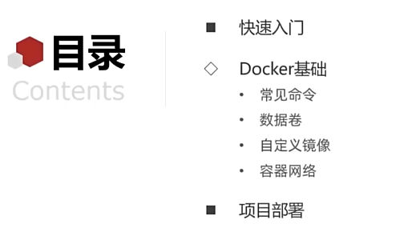
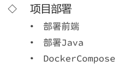
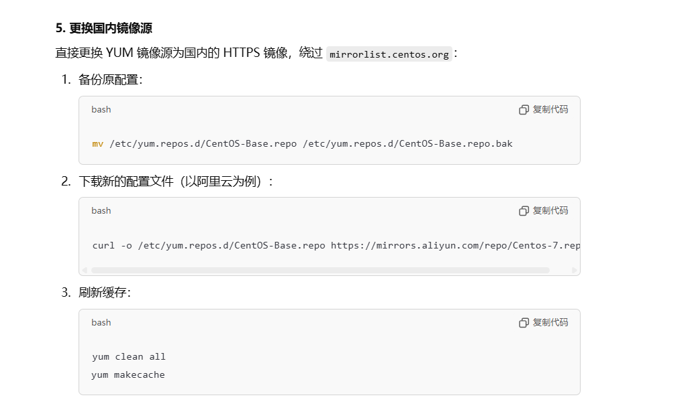
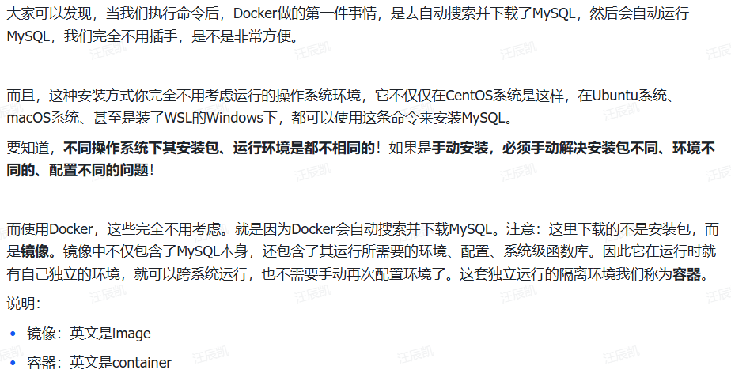
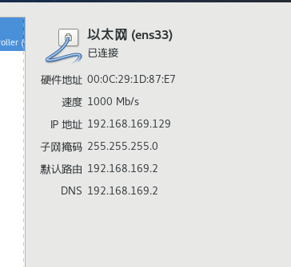

# Ubuntu24.04安装docker

[Ubuntu 24.04.1 LTS 安装Docker 丝滑！！！_ubuntu 24.04.1安装docker-CSDN博客](https://blog.csdn.net/2401_83057947/article/details/142498008)


#  **什么是 Docker？**

Docker 是一个开源的容器化平台，用于开发、分发和运行应用程序。它通过==**将应用及其依赖环境打包到轻量级、可移植的容器中**==，解决了“运行环境不一致”问题，从而使应用能够**跨平台**一致地运行。



[‍‌‌‌‬‍‬‬‍‍‬⁠⁠‬‬‌‬‬‌‌‍⁠‍‌‌安装Docker - 飞书云文档](https://b11et3un53m.feishu.cn/wiki/Rfocw7ctXij2RBkShcucLZbrn2d)


 

[‍‬‌‍‌⁠‬‌‍⁠‍‍⁠‍⁠‍⁠⁠‌⁠day02-Docker - 飞书云文档](https://b11et3un53m.feishu.cn/wiki/MWQIw4Zvhil0I5ktPHwcoqZdnec)

> 因此，Docker安装软件的过程，就是自动搜索下载镜像，然后创建并运行容器的过程。

```shell
# 启动Docker
systemctl start docker

# 停止Docker
systemctl stop docker

# 重启
systemctl restart docker

# 设置开机自启
systemctl enable docker

# 执行docker ps命令，如果不报错，说明安装启动成功
docker ps
```


**虚拟机的ip：**

 


 


```shell
# 启动Docker
systemctl start docker

# 停止Docker
systemctl stop docker

# 重启
systemctl restart docker

# 设置开机自启
systemctl enable docker

# 执行docker ps命令，如果不报错，说明安装启动成功
docker ps
```

```shell
# 创建目录
mkdir -p /etc/docker

#配置镜像加速
# 复制内容
tee /etc/docker/daemon.json <<-'EOF'
{
    "registry-mirrors": [
        "http://hub-mirror.c.163.com",
        "https://mirrors.tuna.tsinghua.edu.cn",
        "http://mirrors.sohu.com",
        "https://ustc-edu-cn.mirror.aliyuncs.com",
        "https://ccr.ccs.tencentyun.com",
        "https://docker.m.daocloud.io",
        "https://docker.awsl9527.cn"
    ]
}
EOF

# 重新加载配置
systemctl daemon-reload

# 重启Docker
systemctl restart docker
```

