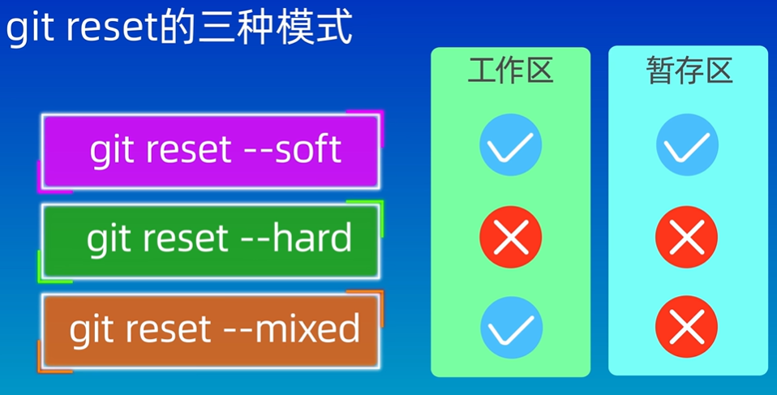

# 初始化仓库

```sh
git init
```

# 添加文件到暂存区 

工作区-->暂存区

```sh
git add <file-name>  # 添加指定文件
git add .            # 添加当前目录下所有文件
```

# 提交更改

暂存区-->本地仓库

```shell
git commit -m "Your commit message"
```


# 查看当前状态

可以查看当前文件的状态，检查哪些文件已修改、哪些文件已暂存，哪些文件还未提交。

```shell
git status
```

# 查看提交历史

```shell
git log
```


# 远程仓库配置

将远程仓库与本地仓库连接

```shell
git remote add origin https://github.com/yourusername/yourrepository.git
```

# 推送更改到远程仓库

```sh
git push -u origin master  # 推送到远程仓库的master分支
```

如果是推送到其他分支，替换`master`为你要推送的分支名称。

-u 是将`origin master`设置为上游分支。如果你之后不指定分支，直接使用 `git push`，Git 会推送当前本地分支到与之对应的远程分支。


# 拉取远程仓库的更新

**git pull**

当其他人在远程仓库中进行提交时，你可以拉取（pull）最新的更改：

```sh
git pull origin master  # 拉取远程仓库的master分支更新
```

- 相当于执行 `git fetch` 后再执行 `git merge`，即它会下载远程更新并自动将其合并到当前分支。
- 如果没有冲突，合并会直接完成，可能会导致你的工作分支发生变化。
- `git pull` 也有一个变种 `git pull --rebase`，可以使用 rebase 代替 merge 来整合远程更新。

**使用场景**：你希望将远程仓库的最新更改直接合并到当前分支。


**git fetch**

1. 获取远程仓库分支的变化，但不会合并到本地仓库分支。

```bash
git fetch origin <branch-name>
```

2. **查看远程追踪分支的更新：**

```bash
git log HEAD..origin/master
```

`HEAD..origin/master` 是 Git 中用来指定提交范围的语法。

表示从 `HEAD` 到 `origin/master` 的提交。它会列出所有在 `origin/master` 中，当前分支还没有的提交。

3. **合并远程更新到当前分支:**

```bash
git merge origin/master
```

or

```bash
git rebase origin/master
```

4. 解决冲突（如果有）: 手动修改冲突文件，然后执行：

```bash
git add <冲突文件>
git merge --continue  # 如果是 merge
git rebase --continue  # 如果是 rebase
```

5. **推送更新（如果需要）**： 如果你已经将远程的更新合并到本地并且需要将你的本地更改推送到远程仓库，可以执行：

```bash
git push
```


## `git fetch` 与 `git pull` 的区别：

- `git fetch` 只是获取更新，不会更改当前的工作分支或文件。
- `git pull` 是 `git fetch` 和 `git merge`（或 `git rebase`）的组合命令，它会自动获取远程更新并合并到当前分支。

因此，`git fetch` 适合用于先获取更新，查看和审查差异，然后决定是否合并，而 `git pull` 则是直接获取并合并。


# 分支管理

**查看分支列表**

```sh
git branch
```

**创建分支**

```sh
git branch branch-name
```

**切换分支**

```sh
git checkout branch-name
git switch branch-name  #推荐
```

**合并分支**

将新的分支合并回主分支（或其他目标分支）。

```sh
git checkout master  # 切换到主分支
git merge branch-name # 将new-feature分支合并到master
```

**解决合并冲突**

如果合并过程中出现冲突，Git会提示你解决冲突。你需要手动编辑冲突文件，并标记为已解决。

```sh
git add <resolved-file>  # 添加已解决的文件
git commit -m "message"            # 提交合并后的更改
```


# 版本回退

```sh
git reflog   //查看操作记录 找到想要回退的操作版本号
git reset --hard 版本号     //进行回退
```

 

```sh
git reset --soft  #会将 HEAD 指针移动到指定的 <commit-hash>，但不会修改暂存区和工作目录。
git reset --hard  #会将 HEAD 指针移动到指定的 <commit-hash>，丢弃所有未提交的修改，包括未暂存的修改和暂存区中的修改.
git reset --mixed #(默认)会将 HEAD 指针移动到指定的 <commit-hash>，并将暂存区的内容更新为该提交的状态，但工作目录中的文件不会被修改。
```


# Head指针

1. 通常Head指针指向**当前分支**，位于当前所在分支的最新提交。
   * 当 `HEAD` 指向一个分支时，Git 会知道该分支的最新提交，所有提交都会被追加到该分支上。
2. `HEAD` 也可以直接指向某个具体的提交，而不是分支。
   * 这个状态通常发生在使用 `git checkout <commit>` 或 `git checkout <commit-hash>` 时。
   * 这时候Head处于**分离 HEAD 状态**。在这种状态下进行的提交会形成一个新的孤立分支，除非你使用 `git checkout -b <new-branch-name>` 将其保存到一个新分支，否则这些提交可能会丢失，因为它们不属于任何现有分支。
3. 当使用 `git reset <commit-hash>` 或 `git reset HEAD~n`（`n` 是一个数字，表示回退几个提交）时，**HEAD 会移动到**指定的提交或回退的提交位置。


# 用户使用 `git clone` 克隆了 GitHub 上的仓库，并且希望提交合并的步骤

1. **克隆仓库**：`git clone <repo-url>`

2. **创建新分支**：`git checkout -b feature-branch`

3. **修改代码并提交**：`git add .` 和 `git commit -m "message"`

4. **推送新分支到远程**：`git push origin feature-branch`

5. **创建拉取请求**：在 GitHub 网站创建 PR，将分支合并到 `master` 或 `main`

6. **审查并合并 PR**：在 GitHub 上审查并合并

7. **拉取更新**：`git pull origin master` 更新本地仓库