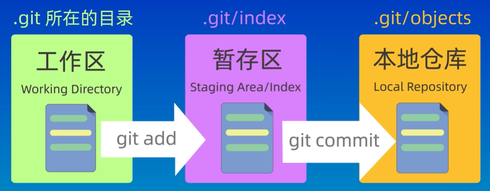

# 创建仓库

方式1：git init   本地创建仓库

方式2：git clone+仓库地址  从远程服务器上克隆一个已经存在的仓库。


# 提交文件

工作区域：



文件状态：


```shell
git init (仓库名)  //创建本地仓库

git status  //查看仓库状态

git add     //将未跟踪的文件添加到暂存区等待提交

git add *.txt  //可以使用通配符
git add .      //把当前文件夹下的所有文件添加到暂存区

git rm --cached		//取消暂存

git commit -m "提交信息"		//提交暂存区中的文件到本地仓库中

git log 		   //查看提交记录
git log --oneline	//简单的提交记录

git ls-files  //列出暂存区的文件（已追踪的文件）
```


# 回退版本

 


操作回溯：

```
git reflog   //查看操作记录 找到想要回退的操作版本号
git reset --hard 版本号     //进行回退
```


# 查看差异


```
git diff    //默认比较工作区和暂存区的内容差异

git diff HEAD  //工作区和版本库的差异

git diff --cached  //暂存区和版本库的差异
```


# 删除文件

```shell
 git rm <file>   //将文件从工作区和暂存区中都删除，不要忘了提交。
 
 git rm --cached <file>   //只想从版本库中删除，而不想删除工作区和暂存区中的文件
```


# 忽略文件

将想忽略文件的文件名加入到.gitignore中。


 

 


> github上给了常用语言的.gitignore模板


# 远程仓库->本地仓库


# 本地仓库->远程仓库

 

```shell
git push -u origin master:main
```


github上的示例代码

```
echo "# DCVC-TCM" >> README.md
git init
git add README.md
git commit -m "first commit"
git branch -M main
git remote add origin https://github.com/wang20220117/DCVC-TCM.git
git push -u origin main
```


## 分支


为了避免分支名和文件名冲突，导致该命令歧义。所以提供了一个新命令来切换分支：

```shell
git switch 分支名

git branch -d     //删除分支
```

 


把dev分支合并到main分支中，首先要切换到main分支，然后执行 git merge dev 命令。


# 解决合并冲突


一般不会在公共的分支上执行rebase操作。


>  修改代码后（可能修改了很多文件），如何将修改的文件push到github?


###### ChatGPT 说：

要将本地修改的代码（多个文件）推送到 GitHub，可以按照以下步骤操作：

------

### **步骤 1：查看修改的文件**

首先，检查哪些文件被修改或新增：

```bash
git status
```

输出示例：

```rust
On branch main
Changes not staged for commit:
  (use "git add <file>..." to update what will be committed)
        modified:   file1.txt
        modified:   file2.txt

Untracked files:
  (use "git add <file>..." to include in what will be committed)
        newfile.txt
```

- **Modified files**：已修改但未暂存的文件。
- **Untracked files**：新文件，未被 Git 跟踪。

------

### **步骤 2：暂存所有修改的文件**

将所有修改的文件添加到暂存区（Staging Area）：

```bash
git add .
```

- `.` 表示添加所有修改的文件（包括新增和已修改的文件）。

- 如果只想暂存特定文件，可以使用：

  ```bash
  git add file1.txt file2.txt
  ```

再次运行 `git status`，查看所有文件是否已经被暂存：

```vb
Changes to be committed:
  (use "git restore --staged <file>..." to unstage)
        modified:   file1.txt
        modified:   file2.txt
        new file:   newfile.txt
```

------

### **步骤 3：提交更改**

将暂存的更改提交到本地仓库，并添加提交说明：

```bash
git commit -m "Your commit message"
```

- `-m`

   后的内容是提交的描述信息，例如：

  ```bash
  git commit -m "Fixed bugs and added new feature X"
  ```

------

### **步骤 4：推送到远程仓库**

将本地的提交推送到 GitHub 的远程仓库：

```bash
git push origin main
```

- `origin` 是远程仓库的名称（默认）。
- `main` 是目标分支。

------

### **完整流程命令**

以下是一系列完整的命令：

```bash
git status                 # 查看文件状态
git add .                  # 添加所有修改到暂存区
git commit -m "提交说明"   # 提交到本地仓库
git push origin main       # 推送到远程仓库
```

------

### **注意事项**

1. **避免推送敏感文件**：检查是否有 `.gitignore` 文件，确保敏感文件（如密码、配置文件等）被忽略。

2. 解决冲突

   ：如果推送时遇到错误提示（如冲突），可以先拉取远程分支的最新内容：

   ```bash
   git pull origin main
   ```

   然后解决冲突后再次推送。

完成这些步骤后，所有修改的文件就会推送到 GitHub 的 `main` 分支！
