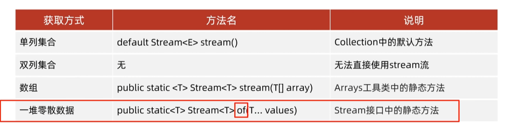

[TOC]


# Stream 流


## 1 得到一条Stream流




```java
    public static void main(String[] args) {

        //1.单列集合获取Stream流
        ArrayList<String> list = new ArrayList<>();
        Collections.addAll(list, "A", "B", "C", "D", "E", "F", "G", "H");
        //获取一条流水线，并把集合中的数据放到流水线上
        Stream<String> stream1 = list.stream();
        //2.双列集合获取Stream流
        HashMap<String,Integer> hm = new HashMap<>();
        hm.put("A", 1);
        hm.put("B", 2);
        hm.put("C", 3);
        hm.put("D", 4);
        //第一种 获取Stream流方法 获取键的Stream流
        Stream<String> stream2 = hm.keySet().stream();

        //第二种方法 获取键值对的Stream流
        Stream<Map.Entry<String, Integer>> stream3 = hm.entrySet().stream();

        //3.数组获取Stream流
        int [] arr = {1,2,3,4,5,6,7,8,9};
        IntStream stream4 = Arrays.stream(arr);

        //4. 一堆零散数据  使用Stream接口中的静态方法
        Stream.of(1,2,3,4,5,6,7,8,9).forEach(s-> System.out.println(s));


    }
```

**Stream接口中静态方法`of`的细节：**


## 2 Stream流的中间方法


`filter方法` 中重写Predicate 接口中的test方法。


**map 方法代码示例：**

```java
public class StreamDemo2 {
    public static void main(String[] args) {
        //Stream流中的map方法：转换流中的数据类型
        ArrayList<String> list = new ArrayList<String>();
        list.add("A-12");
        list.add("B-13");
        list.add("C-14");
        list.add("D-15");
        list.add("E-16");
        list.add("F-17");

        //Function<T,R> T是原本的数据类型，R是要转换成的数据类型
        list.stream().map(new Function<String,Integer>(){
            @Override
            public Integer apply(String s) {
                String[] split = s.split("-");
                int a = Integer.parseInt(split[1]);
                return a;
            }
        }).forEach(System.out::println);

        System.out.println("----------------");

        //使用Lambda表达式简写
        list.stream().map(s -> Integer.parseInt(s.split("-")[1])).forEach(System.out::println);
    }
}
```

## 3 Stream 终结方法


**toArray() 方法：收集流中数据到数组**


**collect()：收集流中数据到集合**


收集到List和Set有什么区别：收集到Set，**无序去重**

 

收集到Map：

```java
public class StreamDemo3 {
    public static void main(String[] args) {
        //收集流到Map
        ArrayList<String> list = new ArrayList<String>();
        list.add("A-12");
        list.add("B-13");
        list.add("C-14");
        list.add("D-15");
        list.add("E-16");
        list.add("F-17");

//        Map<String, Integer> collect = list.stream().collect(Collectors.toMap(new Function<String, String>() {
//            @Override
//            public String apply(String s) {
//                return s.split("-")[0];
//            }
//        }, new Function<String, Integer>() {
//
//            @Override
//            public Integer apply(String s) {
//                return Integer.parseInt(s.split("-")[1]);
//            }
//        }));

        //使用Lambda表达式简写
        Map<String, Integer> collect = list.stream().collect(Collectors.toMap( s -> s.split("-")[0]
                ,  s ->  Integer.parseInt(s.split("-")[1])));

        collect.forEach((k, v) -> System.out.println(k + "=" + v));


    }
}
```

注意点：

​		如果要收集到Map集合中，键不能重复，否则会报错。


练习：

自定义对象过滤并收集：

```java
public class StreamExercise3 {

    public static void main(String[] args) {

        ArrayList<String> nan = new ArrayList<>();
        nan.add("张三，23");
        nan.add("wck,23");
        nan.add("zxc,23");
        nan.add("wmk,23");

        ArrayList<String> nv = new ArrayList<>();
        nv.add("杨理杰,24");
        nv.add("杨过,24");
        nv.add("wmk,24");
        nv.add("zxc,24");

        Stream<String> nanSave = nan.stream().filter(s -> s.split(",")[0].length() == 3).limit(2);

        Stream<String> nvSave = nv.stream().filter(s -> s.split(",")[0].charAt(0)== '杨').skip(1);

        Stream<String> concat = Stream.concat(nanSave, nvSave);

        //String -> Actor 对象 （类型转换） map

        List<Actor> collectFinal = concat.map(new Function<String, Actor>() {

            @Override
            public Actor apply(String s) {
                Actor actor = new Actor();
                actor.setName(s.split(",")[0]);
                actor.setAge(Integer.parseInt(s.split(",")[1]));
                return actor;
            }
        }).collect(Collectors.toList());

        collectFinal.forEach(s -> System.out.println(s));
        System.out.println(collectFinal);
    }
}
```

