# 异常

异常继承体系：

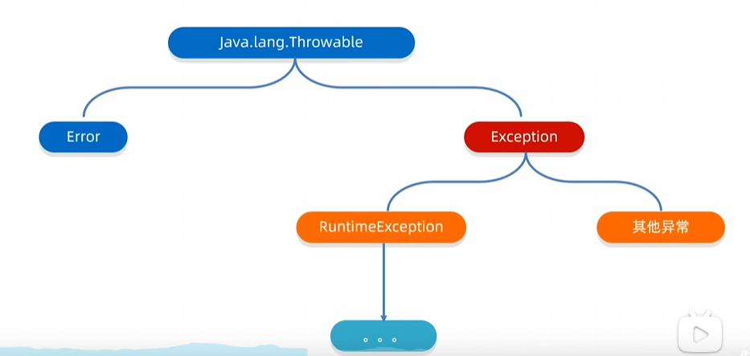

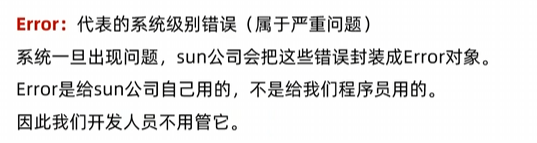

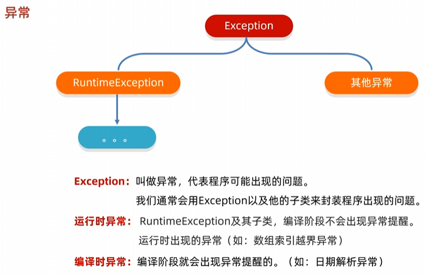

**总结：**

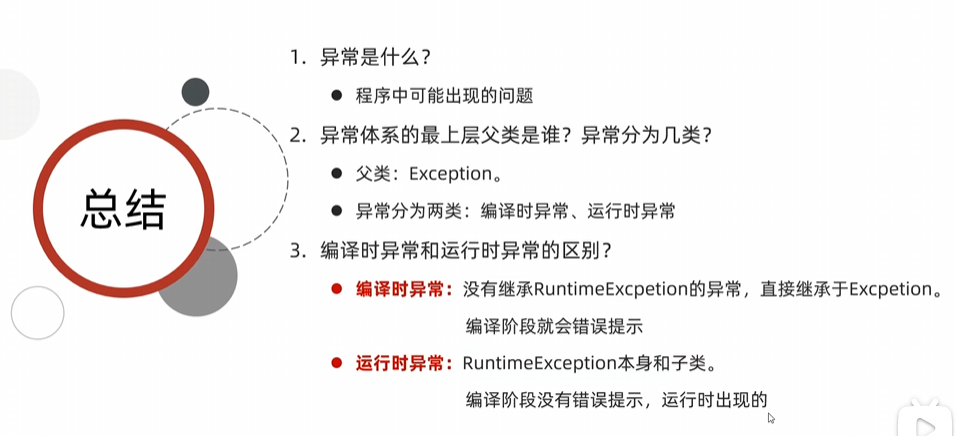

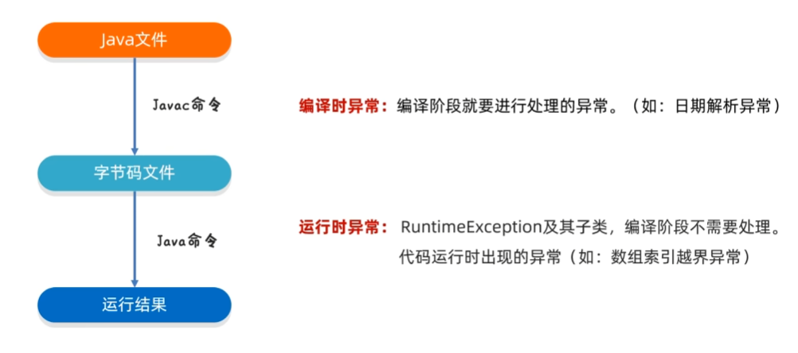

**异常的两个作用：**

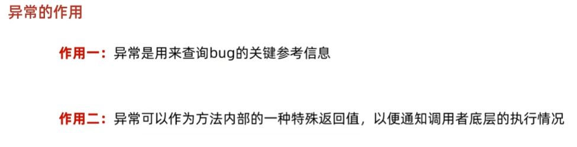

# 异常的处理方式

* JVM 默认的处理方式
* **自己处理**（捕获异常）
* **抛出异常**

JVM默认的处理方式：

* 把异常的名称，异常原因及异常出现的位置等信息输出在了控制台。
* 程序停止执行，下面的代码不会再执行了。

## 自己处理（捕获异常）

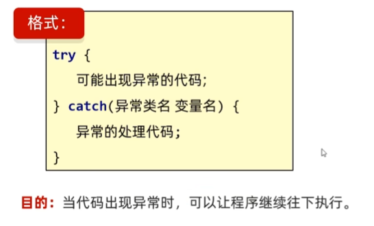

**灵魂四问：**

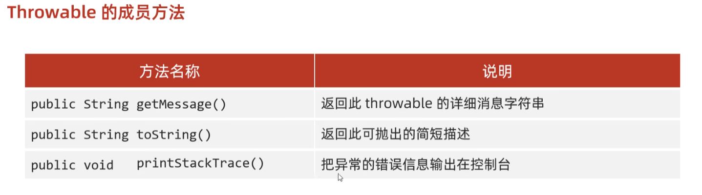

printStackTrace() 最为常用，因为输出的信息最多

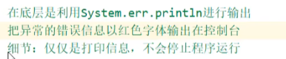

## 抛出异常

在方法中，出现异常了，则抛给方法的调用者。调用者必须try...catch处理这个异常，或者再继续抛出

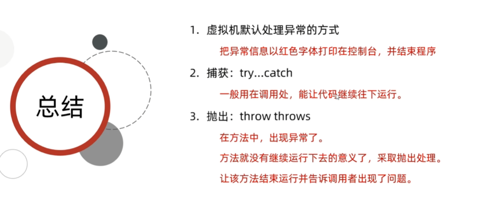

运行时异常 `throws`可以在方法声明处省略不写。

throw在方法中抛出异常。

抛出：告诉调用者出错了。

捕获：不让程序停止。

## 自定义异常

为了更好表述现在出现的问题，避免直接使用运行时异常或者编译时异常的父类。

步骤：

1. 定义异常类，类名要见名知意。
2. 写继承关系：继承RuntimeException 或者 Exception

3. 写空参构造
4. 写带参构造

意义：就是为了让控制台的报错信息更加见名知意。

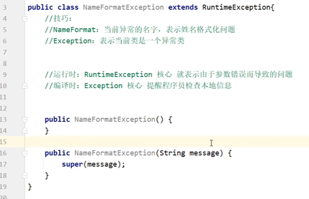

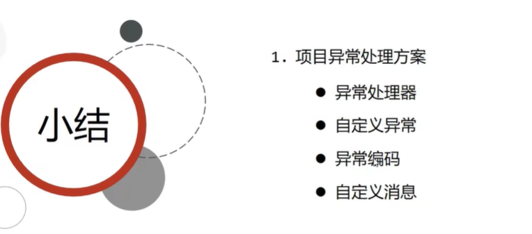
