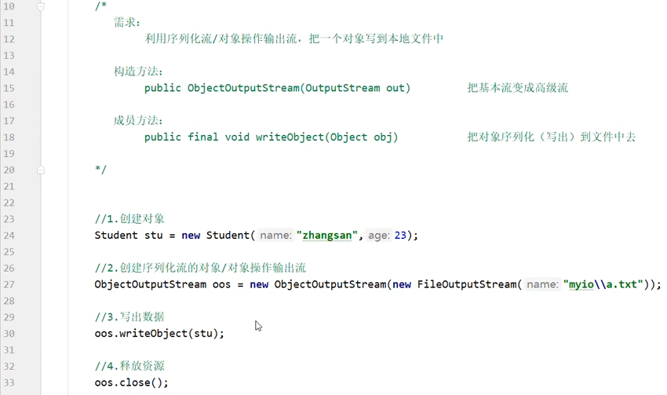

[TOC]


# IO流

**IO流**：存储和读取数据的解决方案

与Stream流相比：Stream流是简化数组和集合的操作。

在Java中，**I/O流**（Input/Output Streams）的作用是处理输入和输出操作。它们提供了一种标准化的方式来读写数据，无论数据来源或目标是文件、网络连接还是其他设备。Java I/O流主要分为两大类：字节流和字符流。


> 输入输出均以程序为中心。


文本文件：

- 这些文件以纯文本格式存储数据，即使用可打印的字符编码，如 ASCII 或 UTF-8。
- 文本文件通常包含人类可读的内容，诸如代码文件（如 `.java`、`.txt`）、配置文件（如 `.config`、`.ini`）等。

二进制文件：

- 这些文件以二进制格式存储数据，即直接存储字节，可能包含不可打印的字符。
- 二进制文件通常包含计算机可读的信息，诸如图像文件（如 `.jpg`、`.png`）、音频文件（如 `.mp3`、`.wav`）、视频文件（如 `.mp4`、`.avi`）、可执行文件（如 `.exe`）、压缩文件（如 `.zip`）等。


# 字节流

## IO流体系和字节输出流基本用法


### FileOutputStream

操作本地文件的字节输出流，可以把程序中的数据写到本地文件中。


书写步骤：

1. 创建字节输出流对象
2. 写数据
3. 释放资源

```java
        FileOutputStream fos = new FileOutputStream("G:\\a.txt");
        fos.write(97);
        fos.close();
```


<u>***如果文件不存在会创建一个新的文件！***</u>


**FileOutputStream 写数据的三种方式：**


```java
byte[] b = {97,98,99,100};  //字节数组
```


**换行和续写：**

换行符：

* windows：`\r\n    `
* Linux：` \n`

细节：

​		在windows系统中，java对回车换行进行了优化。虽然完整的是\r\n，但是只写一个\r或\n，java也会实现换行，因为java在底层会补全。

建议：

​		不要省略，还是写全


FileOutputStream的构造函数有一个续写开关，第二个参数设置为true表示打开续写开关。

```java
public class IOdemo {
    public static void main(String[] args) throws IOException {
        //FileOutputStream的构造函数有一个续写开关
        FileOutputStream fos = new FileOutputStream("G:\\a.txt",true);
        String str = "abcdefg";
        String str2 = "666";

        fos.write(str.getBytes());
        //再次写出一个换行符
        //windows：\r\n    Linux: \n
        String wrap = "\r\n";
        fos.write(wrap.getBytes());

        fos.write(str2.getBytes());
        fos.close();

    }
}
```


**总结：**


## 字节输入流基本用法

FileInputStream

实现步骤：

1. 创建对象
2. 读取数据
3. 释放资源

```java
	    FileInputStream fis = new FileInputStream("G:\\a.txt");  //路径或者 File对象
        char b1 = (char) fis.read();
        System.out.println(b1);
        char b2 = (char)fis.read();
        System.out.println(b2);
        char b3 = (char)fis.read();
        System.out.println(b3);
        fis.close();
```


### 循环读取

```java
public class InputDemo {
    public static void main(String[] args) throws IOException {

        FileInputStream fis = new FileInputStream("G:\\a.txt");
        int b;
        while ((b=fis.read())!=-1) {
            System.out.println((char)b);
        }
    }
}
```


## 文件拷贝

边读边写！


一次读一个字节的弊端：太慢


改进：

使用字节数组byte[] buf ，一次拷贝数组的大小


```java
public class InputDemo {
    public static void main(String[] args) throws IOException {

        long start = System.currentTimeMillis();
        FileInputStream fis = new FileInputStream("G:\\PtDownloads\\test.mp4");
        FileOutputStream fos = new FileOutputStream("G:\\out.mp4");
        byte[] buf = new byte[1024*1024*5];
        int b;
        while ((b=fis.read(buf))!=-1) {
            fos.write(buf,0,b);   //注意要加上起始和结束索引
        }

        fis.close();
        fos.close();
        long end = System.currentTimeMillis();
        System.out.println(end-start);

    }
}
```


## try...catch异常处理


简化：


try后面的小括号：只有实现了AutoCloseable接口的类，才能在小括号中创建对象。


JDK7写法：


JDK9写法：


## 字符集详解


### Unicode字符集

UTF-8：可变长度字符编码


UTF-8 不是字符集，是Unicode字符集的一种编码方式。


### java中编码和解码


```java
        String str = "爱你";
        byte[] bytes = str.getBytes();
        System.out.println(Arrays.toString(bytes));
//解码
        String str2 = new String(bytes);
        System.out.println(str2);
//默认使用UTF-8编码，一个汉字3个字节
输出：[-25, -120, -79, -28, -67, -96]
爱你
    

//指定GBK编码
public class CodeDemo {
    public static void main(String[] args) throws UnsupportedEncodingException {
        String str = "爱你";
        byte[] bytes = str.getBytes("GBK");
        System.out.println(Arrays.toString(bytes));
        //解码
        String str2 = new String(bytes,"GBK");
        System.out.println(str2);
    }
}
输出：[-80, -82, -60, -29]
爱你
//一个汉字两个字节    
```

# 字符流


解决第一个问题：读取数据时未读完整个汉字。

字符流：***默认也是一次读一个字节，当遇到中文时，一次读多个字节。***


## FileReader


想看到中文汉字就把这些十进制数据进行**强转**。

### 有参read

```java
public int read(char[] buffer)    //读取多个数据，读到末尾返回-1
```

不同的是：这里用的是字符数组`char[] buffer`

其他读取操作与FileInputStream中的read一致。

有参的read方法 = 空参的read方法 + 强制类型转换

## FileWriter


write 方法：


字符串和字符数组都可直接写。

## 字符输入流的底层

字符输入流的底层 在内存中有一个缓冲区。目的是为了提高效率，避免了频繁读取硬盘。


## 字符输出流的底层


**三种情况缓冲区里的数据会保存到本地：**

1. 缓冲区满了
2. 手动 flush
3. close：释放资源


# 高级流

就是把基本流做了包装并额外添加了一些新功能。即***高级流的参数是基本流***。


## 缓冲流（字节缓冲流和字符缓冲流）


创建对象的时候是需要关联基本流的，读写对象还是要靠基本流


**字符缓冲流：**


**readLine方法：**


总结：

* 有**四种缓冲流**

  * 字节缓冲输入流：BufferedInputStream
  * 字节缓冲输出流：BufferedOutputStream
  * 字符缓冲输入流：BufferedReader
  * 字符缓冲输出流：BufferedWriter

* 缓冲流为什么能提高性能

  * 缓冲流自带长度为8192的缓冲区
    * 字符缓冲区大小为 8192*2 字节
    * 字节缓冲区大小为 8192*1 字节
  * 可以显著提高字节流的读写性能
  * 对字符流的读写性能提高不明显，对字符流而言关键是**两个特有方法**（一次读取一行 和 跨平台的换行）。

  

## 转换流

是字符流和字节流之间的桥梁。

**参数均为字节流**

* 字符转换输入流 InputStreamReader
* 字符转换输出流 OutputStreamWriter


作用1：指定字符集读写数据（JDK11之后已淘汰）

**作用2：字节流想用字符流中的方法。**


练习一：

1. 利用转换流按照指定字符编码读取（了解）


JDK11后被淘汰，替代方案：


2. 利用转换流按照指定字符编码写

​	

3. 将本地的GBK文件，转成UTF-8

  

练习二：

利用字节流读取文件中的数据，每次读一整行，而不能出现乱码。（***利用字符流的方法***）


## 序列化流

可以把java中的对象写到本地文件中。又称 对象操作输出流

**


Serializable接口里面没有抽象方法，没有抽象方法的接口被称为标记型接口。一旦实现这个接口，这个类的对象就可以被序列化。



**反序列化流：**

把序列化到本地文件中的对象，读取到程序中来。

 

 


**细节：**


## 打印流

有字节打印流 PrintStream和字符打印流PrintWriter 两个类

* 打印流只有写，没有读
* 特有方法
  * 

什么是自动刷新？

PrintWriter默认会将数据先写入到内存缓冲区，然后根据一定的条件（例如缓冲区满、流关闭等）才将数据真正写入到目标设备。调用`flush()`方法可以*<u>立即将缓冲区中的内容刷新到目标</u>*，确保数据不会因为程序异常或未及时刷新而丢失。

**字节打印流：**


成员方法：


**字符打印流：**


成员方法：


构造方法关联 字节输出流 / 字符输出流 / 字符串 / 文件


***System.out.println()与打印流的关系：***

 

 

总结：

 


## 解压缩流/压缩流

 

java中只能识别zip格式的压缩包


**解压：**

 

**压缩：**

压缩本质：把每一个（文件/文件夹）看成ZipEntry对象放到压缩包中。


1. 压缩单个文件：


2. 压缩一个文件夹

```java
/*
* 单个文件压缩步骤：
* 1. 创建压缩流关联压缩包
* 2. 创建ZipEntry对象，表示压缩包里面的每一个文件和文件夹，参数为String
* 3. 把ZipEntry对象放到压缩包中
* 4. 使用字节输入流将src文件中的数据写到压缩包中
*
* 文件夹压缩步骤：
* 1.创建压缩流关联压缩包
* 2. 遍历待压缩文件夹
* 3. 如果是文件，重复单个文件压缩步骤
* 4. 如果是文件夹，则递归
* */
public class Demo1 {
    public static void main(String[] args) throws IOException {

        //要压缩文件夹的路径
        File src = new File("G:\\yasuo");
        //压缩包的路径
        File dest = new File("G:\\yasuo.zip");
        //创建压缩流关联压缩包
        ZipOutputStream zos = new ZipOutputStream(new FileOutputStream(dest));

        //压缩
        toZip(src,zos,src.getName());
        //释放
        zos.close();
    }

    public static void toZip(File src, ZipOutputStream zos, String name) throws IOException {

        File[] files = src.listFiles();
        for (File file : files) {
            if (file.isFile()) {
                //文件复制
                ZipEntry ze = new ZipEntry(name+"\\"+file.getName());
                zos.putNextEntry(ze);
                FileInputStream fis = new FileInputStream(file);

                int b;
                while ((b = fis.read()) != -1) {
                    zos.write(b);
                }
                fis.close();
                zos.closeEntry();

            }
            else {
                //文件夹压缩
                toZip(file,zos,name+"\\"+file.getName());

            }
        }

    }

}
```

