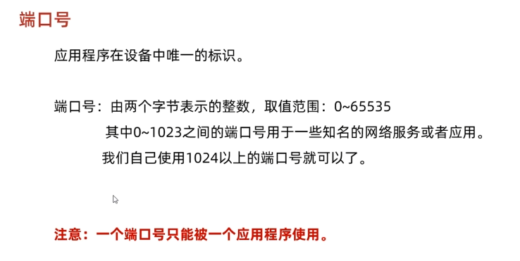
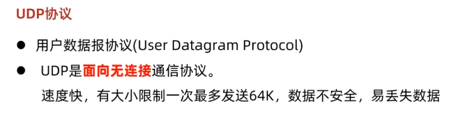
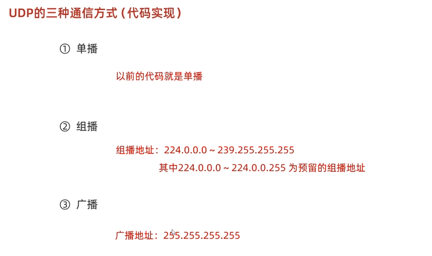
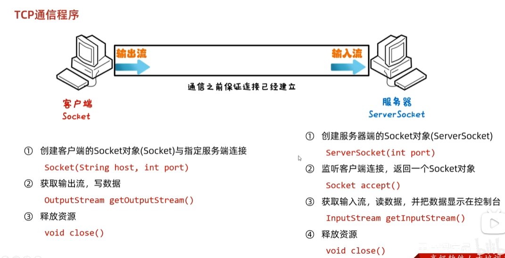
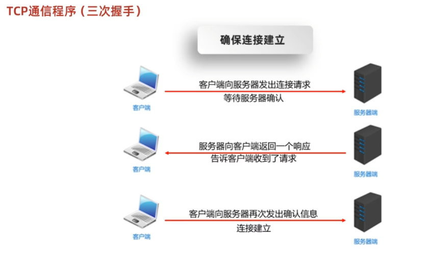
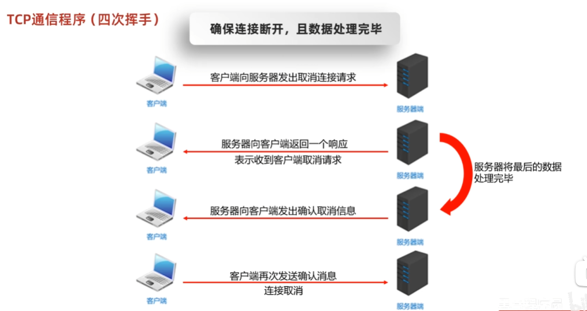

# 网络编程

Java使用 java.net包

常见的软件架构：

C/S：客户端/服务器

B/S：浏览器/服务器


网络编程三要素：

1. **IP**  ：设备在网络中的地址，唯一的标识
2. **端口号** ： 应用程序在设备中唯一的标识
3. **协议** ： 数据在网络中传输的规则。 常用协议有UDP、TCP、http、https、ftp


192.168 开头为私有ip

127.0.0.1 本地环回地址，也称本地IP

> * 域名主要用于标识和定位服务器或服务的名称，而网址则是用于指向具体资源的地址。
>
> * 域名是网络中的标识符，具有唯一性和可读性；而网址则是直接用来访问和定位资源的具体路径。
>
> * 一个完整的网址包含了协议（如 http:// 或 https://）、域名（如 [example.com](http://example.com/)）、路径（指向具体资源的位置）、以及可选的查询参数和片段标识符。


**端口号：**

 

**协议：**

在计算机网络中，连接和通信的规则被称为网络通信协议。

 

## UDP通信程序（发送数据）

1. 创建发送端的DatagramSocket 对象
2. 数据打包（DatagramPacket）
3. 发送数据
4. 释放资源


示例：

```java
public class Send {
    public static void main(String[] args) throws IOException {
        InetAddress ip = InetAddress.getByName("127.0.0.1");
//        System.out.println(ip);

        //使用udp协议发送数据
        //因为是同一台电脑，所以发送端口和接收端口不能一致。
        DatagramSocket socket = new DatagramSocket(8889);

        //打包数据
        String str = "hello";
        byte[] bytes = str.getBytes();
        DatagramPacket packet = new DatagramPacket(bytes, bytes.length, ip, 8888);
        socket.send(packet);
        socket.close();
    }
}
```

## UDP接受数据

1. 创建接受端的DatagramSocket对象
2. 接收打包好的数据
3. 解析数据包
4. 释放资源


接收时要绑定端口，绑定的端口和发送的端口一致。

```java
public class Receive {
    public static void main(String[] args) throws IOException {

        //指定接收端口
        DatagramSocket ds = new DatagramSocket(8888);

        //接收数据包
        byte[] bytes = new byte[1024];
        DatagramPacket dp = new DatagramPacket(bytes, bytes.length);
        //receive方法是阻塞的，如果接收不到数据就会一致死等
        ds.receive(dp);

        //解析数据包
        byte[] data = dp.getData();
        int len = data.length;
        InetAddress address = dp.getAddress();
        int port = dp.getPort();

        System.out.println("接收到数据"+new String(data,0,len));
        System.out.println(port);

        ds.close();


    }
}
```

## UDP的三种通信方式

 


## TCP 通信

TCP通信协议是一种可靠的网络协议，它在通信的两端各建立一个Socket对象。

通信之前要保证连接已经建立。

通过Socket产生IO流来进行网络通信。

 


```java
public class Send {
    public static void main(String[] args) throws IOException {

        Socket socket = new Socket("127.0.0.1",8888);

        OutputStream os = socket.getOutputStream();

        os.write("你好".getBytes());

        os.close();

        socket.close();

    }
}


public class Receive {
    public static void main(String[] args) throws IOException {

        ServerSocket socker = new ServerSocket(8888);

        Socket socket = socker.accept();

        InputStream in = socket.getInputStream();

        InputStreamReader isr = new InputStreamReader(in);

        int b;
        while ((b = isr.read()) != -1) {
            System.out.print((char) b);
        }

    }
}
```


### TCP三次握手 四次挥手

 

 