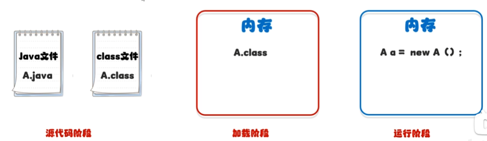

# 反射

反射允许对成员变量，成员方法和构造方法的信息进行编程访问。

>利用反射可以获取类中的成员变量、成员方法和构造函数。即可以获取到类中的所有信息。

 

## 获取

获取class对象 (字节码对象) 的三种方式：

1. Class.forName("全类名")  ：全类名就是`包名+类名`的格式
2. 类名.class
3. 对象.getClass()；

 

源代码阶段使用第一种方式，

加载阶段使用第二种方式，

运行阶段使用第三种方式。

使用情况：

第一种最为常用；

第二种一般当作参数进行传递，在多线程中就当作锁对象传给synchronize();

第三种需要在对象创建后才能使用。

## 解剖（从字节码对象中获取... 并解剖）

在Java中万物皆对象

Constructor是构造方法的对象；

Filed是成员变量(字段)的对象；

Method是成员方法的对象。

# spring中是如何用到反射的

