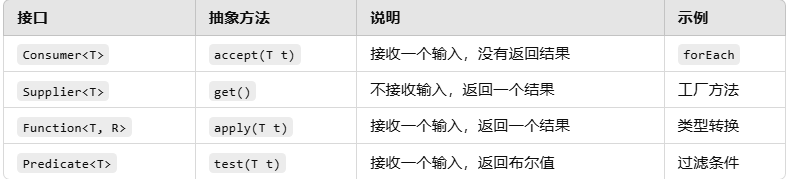

[TOC]


**Java 函数式编程** 是 Java 8 引入的一种编程范式，主要通过 **Lambda 表达式** 和 **函数式接口** 实现。函数式编程强调**函数作为一等公民**，通过将行为（函数）传递给方法，提升代码的简洁性和可读性。

# 1、函数式编程的核心概念

## （1） 函数式接口

**定义**：函数式接口是**只包含一个抽象方法**的接口。

**作用**：作为 Lambda 表达式的类型。

**注解**：`@FunctionalInterface` 可用来标识函数式接口（非必须，但推荐使用）。


示例代码：

```java
@FunctionalInterface
public interface MyFunction {
    void execute(); // 只有一个抽象方法
}
```


## （2）Lambda表达式

**定义**：Lambda 表达式是**匿名函数**，用来简化代码，表示一种行为（函数）。

**语法**：`(参数列表) -> {函数体}`

==Lambda表达式可以自动替换掉函数式接口中的抽象方法，而不需要用匿名内部类去实现接口。==这正是 Lambda 表达式的核心功能。


# 2、Java内置的函数式接口

Java 8 提供了**四大核心函数式接口**，位于 `java.util.function` 包中：

 

### **示例代码**

#### 1. **`Consumer<T>`：接收输入无返回**

```java
import java.util.function.Consumer;

public class ConsumerExample {
    public static void main(String[] args) {
        Consumer<String> print = s -> System.out.println("Hello, " + s);
        print.accept("World"); // 输出：Hello, World
    }
}
```

#### 2. **`Supplier<T>`：无输入返回一个结果**

```java
import java.util.function.Supplier;

public class SupplierExample {
    public static void main(String[] args) {
        Supplier<Double> randomSupplier = () -> Math.random();
        System.out.println(randomSupplier.get()); // 输出一个随机数
    }
}
```

#### 3. **`Function<T, R>`：输入输出类型不同**

```java
import java.util.function.Function;

public class FunctionExample {
    public static void main(String[] args) {
        Function<String, Integer> lengthFunction = s -> s.length();
        System.out.println(lengthFunction.apply("Hello")); // 输出：5
    }
}
```

#### 4. **`Predicate<T>`：输入返回布尔值**

```java
import java.util.function.Predicate;

public class PredicateExample {
    public static void main(String[] args) {
        Predicate<Integer> isEven = n -> n % 2 == 0;
        System.out.println(isEven.test(4)); // 输出：true
    }
}
```


# 3、方法引用

方法引用是 Lambda 表达式的简化形式，**直接引用现有的方法**。常见的四种方法引用：

1. **静态方法引用**：`ClassName::staticMethod`
2. **实例方法引用**：`instance::methodName`
3. **特定类型的实例方法引用**：`ClassName::methodName`
4. **构造方法引用**：`ClassName::new`


**示例代码：**

```java
import java.util.function.Supplier;

public class MethodReferenceExample {
    public static void main(String[] args) {
        // 构造方法引用
        Supplier<String> supplier = String::new;
        System.out.println("Supplier result: " + supplier.get());

        // 静态方法引用
        Supplier<Double> randomSupplier = Math::random;
        System.out.println("Random: " + randomSupplier.get());

        // 实例方法引用
        String str = "hello";
        Supplier<String> upperSupplier = str::toUpperCase;
        System.out.println(upperSupplier.get()); // 输出：HELLO
    }
}
```

# **5、总结**

Java 函数式编程的核心包括：

1. **函数式接口**：`@FunctionalInterface` 定义只包含一个抽象方法的接口。
2. **Lambda 表达式**：简洁地传递函数行为。
3. **方法引用**：简化 Lambda 表达式的写法，直接引用方法。
4. **内置函数式接口**：如 `Consumer`、`Supplier`、`Function` 和 `Predicate`。
