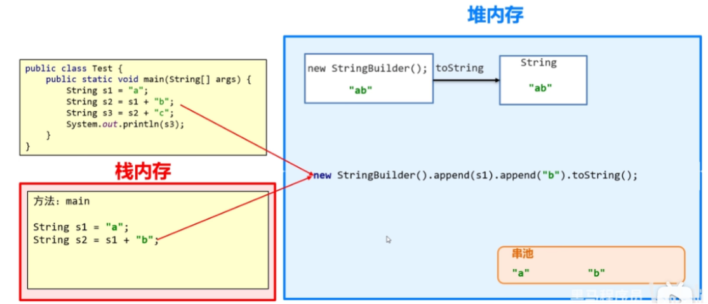
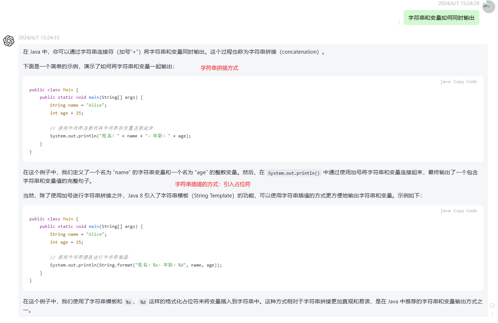

[TOC]


# 1、String类

java.lang.String类代表字符串，Java程序中的所有字符串（例如"abc"）都为此类的对象。

***字符串的内容不能更改*。**
## 创建String对象的两种方式

1. 直接赋值：`String name = "wck";`
2. **new**，利用构造方法： `String s1 = new String("wck")`

String的构造方法：
```java
public String();//空参构造，创建空白字符串
public String(String original);//根据传入的字符串创建字符串对象
public String(char[] chs);//根据字符数组创建对象
public String(byte[] chs);//根据字节数组，创建对象
```

## String 内存原理
1. 直接赋值

    当使用双引号直接赋值时，系统会检查该字符串在**串池**中是否存在。不存在就创建新的，存在则复用。

2. new出来的

    每一次new都在堆中创建新空间，不存在复用。

> 字符串池是在堆内存中专门用于存储字符串字面量的区域。这个池用于优化内存使用，通过共享字符串对象来减少重复创建。


## ==号比的是什么

基本数据类型比较的是数据值。

引用数据类型比较的是地址值。

示例代码：

```java
String s1 = "abc"; //串池中的地址
String s2 = "abc"; //串池中的地址
System.out.println(s1 == s2); //true
String s1 = new String("abc"); //堆中的地址
String s2 = "abc"; //串池中的地址
System.out.println(s1 == s2); //false
```

单纯的字符串比较使用 `equals`方法

* `boolean equals`(要比较的字符串)&emsp; 完全一样为true，否则为false
* `boolean equalsignoreCase`(要比较的字符串)&emsp; 忽略大小写的比较

## String的常用方法

* `public char charAt(int index)`：根据索引返回字符
* `public int length()`：返回此字符串的长度
* 数组的长度：数组名.length
* 字符串的长度：字符串对象.length()
* `+`:字符串拼接

# 2、StringBuilder

StringBuilder 是一个容器，创建完之后里面的内容是可以变化的。

- 作用：提高字符串的操作效率
- 使用场景：
  字符串的拼接和反转

**StringBuilder的构造方法**：

```java
StringBuilder sb = new StringBuilder()  //空参构造
StringBuilder sb = new StringBuilder("abc")  //有参构造
```

**成员方法**：

```java
public StringBuilder append(任意类型)   //添加数据，返回对象本身
public StringBuilder reverse()         //翻转容器中的内容
public int length()             //返回长度
public String toString()      //将StringBuilder转换为String
```

测试：
```java
public class test {
    public static void main(String[] args) {
        StringBuilder sb = new StringBuilder();
        sb.append("abc");
        System.out.println(sb);
        sb.reverse();
        System.out.println(sb);
        System.out.println(sb.length());
        String s = sb.toString();
        System.out.println(s);
    }
}
```

# StringJoiner
也是容器，内容可变。JDK8出现

在**拼接**字符串时，可以指定间隔符号，开始符号和结束符号

**构造方法**

```java
public StringJoiner(间隔符号)
public StringJoiner(间隔符号，开始符号，结束符号)
```


**成员方法**
```java
public StringJoiner add(添加的内容)
public int length()
public String toString()
```

# 字符串底层原理

**字符串存储的内存原理**

* 直接赋值会复用字符串常量池中的
* new 出来不会复用，而是开辟一个新空间。

**==号比的是什么**

* 基本数据类型比较数据值
* 引用数据类型比较地址值

**字符串拼接的底层原理**



有变量参与的一次字符串拼接，产生两个对象：一个`StringBuilder`对象和一个`String`对象。因此很浪费内存和性能。


* 如果没有变量参与，都是字符串直接相加，编译之后就是拼接后的结果，会复用串池中的字符串。
* 如果有变量参与，则会创建新的字符串，浪费内存。

如果之后想对字符串拼接，不要直接`+`，使用`StringBuilder`或者`StringJoiner`。

**StringBuilder提高效率原因**

* 所有要拼接的内容都会往`StringBuilder`中放，不会创建很多无用的空间，节约内存。

**StringBuilder的扩容机制**
* 默认创建一个长度为16的字节数组。
* 添加的内容长度小于16，直接存。
* 添加的内容大于16会扩容（原来的容量*2 + 2）。
* 如果一次扩容之后还不够，以实际长度为准。



