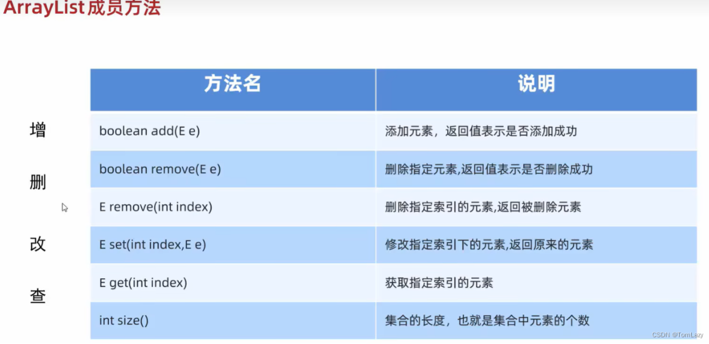

# 集合

集合可以自动扩容，集合不能存储基本数据类型，要将基本数据类型转换成其包装类，才能存入集合。

**集合和数组的对比**

* 数组长度固定，集合长度可变。

* ***集合只能存引用数据类型***，数组引用和基本数据类型都可存。


**常用集合类：ArrayList**

泛型：限定集合中存储数据的类型 `ArrayList<E>`


```java
ArrayList<String> list = new ArrayList<>();
```

ArrayList 有**三种构造函数**：

1. 无参构造函数


2. 带初始容量参数的构造函数

```java
ArrayList<String> list2 = new ArrayList<>(20);
```

3. 带另一个集合的构造函数

```java
// 创建并初始化一个集合
List<String> otherList = new ArrayList<>();
otherList.add("Hello");
otherList.add("World");

// 使用另一个集合来创建 ArrayList
ArrayList<String> list3 = new ArrayList<>(otherList);
```


## ArrayList的成员方法



```java
public class TestSet {
    public static void main(String[] args) {
        ArrayList<String> list = new ArrayList<>();
        System.out.println(list);
        list.add("hello");              //添加元素
        list.add("hello2");
        System.out.println(list);
//        list.remove("hello");          //删除指定元素
        list.remove(1);           //根据索引删除
        System.out.println(list);
        list.set(0, "world");           //根据索引修改元素
        System.out.println(list);
        System.out.println(list.get(0)); //获取指定元素
        System.out.println(list.size()); //集合的长度

    }
}

```

