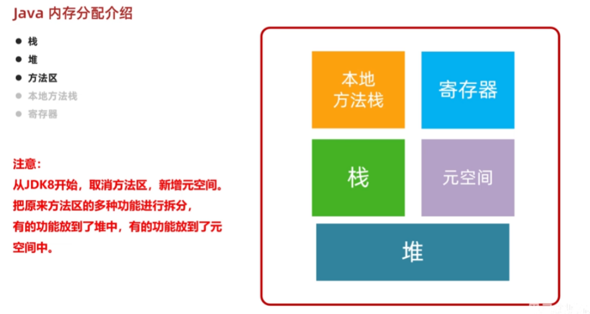
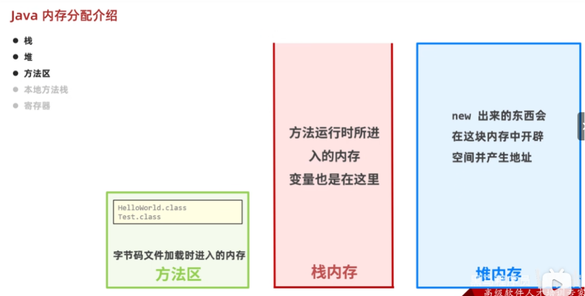
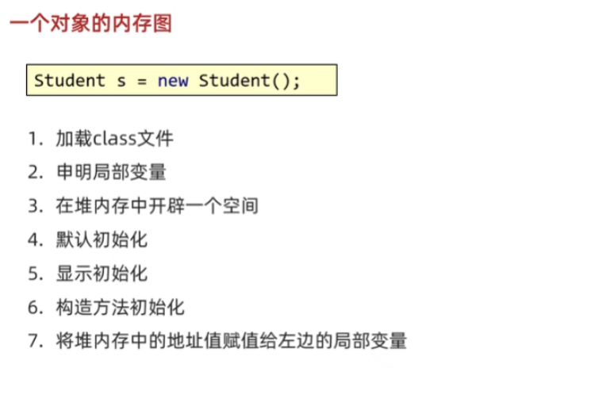
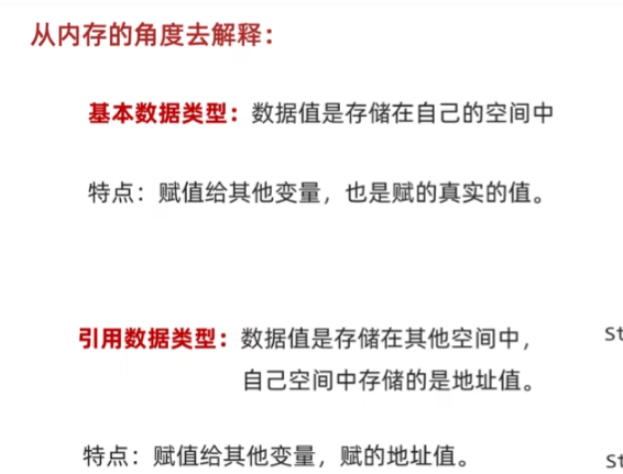
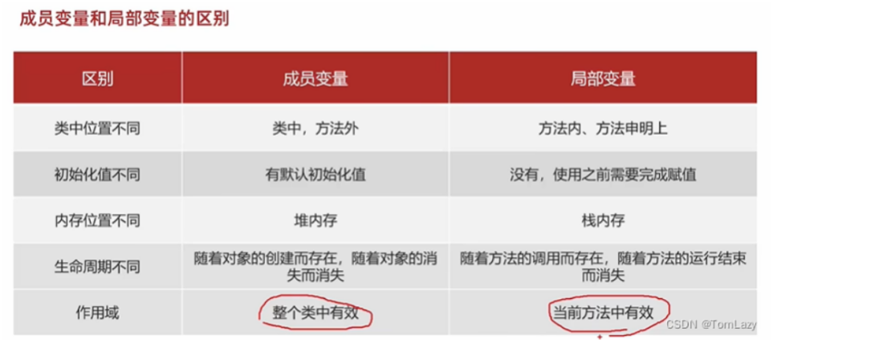

[TOC]


# 定义类

```java
public class 类名{
    1、成员变量
    2、成员方法
    3、构造方法
    4、代码块
    5、内部类

}
```

类名 对象名 = `new` 类名（）

* 访问属性：对象名.成员变量 
* 访问行为：对象名.方法名()


一些约定俗成：

* 用来描述一类事物的类，专业叫做：**javabean**类，在javabean中不写main方法。
* 编写main方法的类叫做测试类。

定义类的注意事项：

* 类名首字母建议大写，驼峰模式。
* 一个java文件中可以定义多个class类，但只能一个类是`public`修饰，而且`public`修饰的类名必须成为代码文件名。实际开发中还是建议一个文件定义一个`class`类。
* 成员变量的完整定义格式是：**修饰符 数据类型 变量名称 = 初始化值;** 一般无需指定初始化值，存在默认值。

# 封装
封装：对象代表什么，就得封装对应的数据，并提供数据对应的行为。(属性+行为)

## privite 关键字
* 是一个权限修饰符
* 可以修饰成员变量和方法
* 被`privite`修饰的成员只能在本类中才能访问。不能由对象实例访问，不能在类外访问。

针对每一个私有化的成员变量都需要提供 `get`和`set`方法。

set方法：给成员变量赋值。

get方法：对外提供成员变量的值。

# this关键字

当成员变量和局部变量重名时，遵守就近原则，谁离我近，我就用谁。

为了有所区分，我们可以用this.变量名的形式去表示成员变量。

this的作用就是区别成员变量和局部变量。

# 构造方法

构造方法也叫做构造器、构造函数。

作用：在创建对象的时候给成员变量进行赋值的。

## 构造方法的格式

```java
public class Student{
    修饰符 类名(参数){
        方法体;
    }
}
```

* 构造方法名与类名完全。
* 没有返回值类型，连void都没有。
* 没有具体的返回值（不能由return带回结果数据）

> 创建对象的时候由虚拟机调用，不能手动调用构造方法。
>
> 每创建一次对象，就会调用一次构造方法。

## 构造方法的注意事项
1. 构造方法的定义
   1. 如果没有定义构造方法，系统将给出一个默认的无参构造方法。
   2. 如果定义了构造方法，系统就不再提供默认的构造方法。
   
   > 在 Java 中，如果你定义了有参构造方法但没有定义无参构造方法，且你确实需要使用无参构造方法来创建对象，那么你需要显式地提供一个无参构造方法。否则，Java 不会默认为你提供无参构造方法。
   
2. 构造方法的重载
   1. 带参构造方法和无参构造方法，两者方法名相同，但是参数不同，这叫做构造方法的重载。
   
3. 推荐的使用方式
   1. 无论是否使用，都手动书写无参数构造方法，和带全部参数的构造方法。

创建对象的时候，虚拟机会自动调用构造方法，作用是给成员变量进行初始化。

# 标准JavaBean类
1. 成员变量使用private修饰，类名需要见名知意。
2. 至少提供两个构造方法
   1. 无参构造
   2. 带全部参数的构造方法
3. 提供每一个成员变量对应的`set`,`get`方法。

# 对象内存图



jdk8之后，加载字节码的功能放在了元空间中。



创建对象计算机所做的操作：



**默认初始化**：`String`的默认初始化就是 `null` ,`int`的默认初始化就是 `0`...

**显示初始化**：就是在类定义中如果给了初始值，就是显示初始化，如果没有则执行默认初始化。

**构造方法初始化**：空参构造和有参构造。

# 基本和引用数据类型在内存中的区别



# this的内存原理

`this`关键字在Java中用于引用当前对象的实例

this的作用：区别局部变量和成员变量。

this的本质：所在方法调用者的地址值。

Note:成员变量和局部变量的区别



成员变量存储在堆中，局部变量存储在栈中。