[TOC]


# 静态

## 静态变量

被`static`修饰的成员变量，叫做静态变量。

特点

* 被该类所有对象**共享**。
* 不属于对象，属于类。
* 随着类的加载而加载，优先于对象存在。

调用方式：

* 类名调用（推荐）
* 对象名调用


某个属性能否被`static`修饰就看其是否“共享”。

Static的内存图：

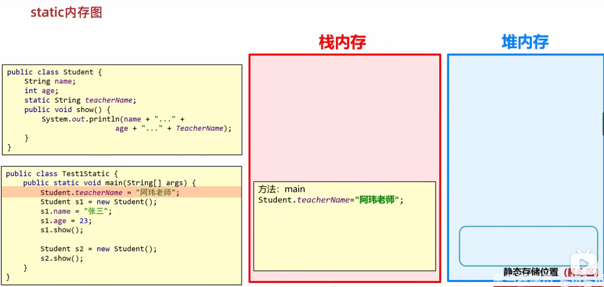

加载类时在堆内存中单独创建了一个**静态区**用于存储所有静态变量。

## 静态方法

被`static`修饰的成员方法，叫做静态方法。

特点：

* 多用在测试类和***工具类***当中。
* javabean类中很少会用。

调用方法：

* 类名调用（推荐）
* 对象调用

Note:

**工具类**：帮助我们做一些事，但是不描述任何事物的类。

* 类名见名知意
* **私有化构造方法** （不让外界创建其对象）
* **方法定义为静态**（意味着该方法与特定类的实例化对象无关，可以直接通过类名调用，而不需要创建类的实例。静态方法通常用于执行与特定对象实例无关的操作）

回顾：

* Javabean类：用来描述一类事物的类。
* 测试类：用来检查其他类是否书写正确，带有main方法的类，是程序的入口。

`static`方法的注意事项：

1. *<u>静态方法只能访问静态变量和静态方法</u>* (重点)
2. 非静态方法可以访问静态变量或者静态方法，也可以访问非静态的成员变量和非静态的成员方法。
3. 静态方法中没有`this`关键字。*静态方法是与类相关联的，而不是与具体的对象实例相关联。因此，静态方法中没有 `this` 关键字。*


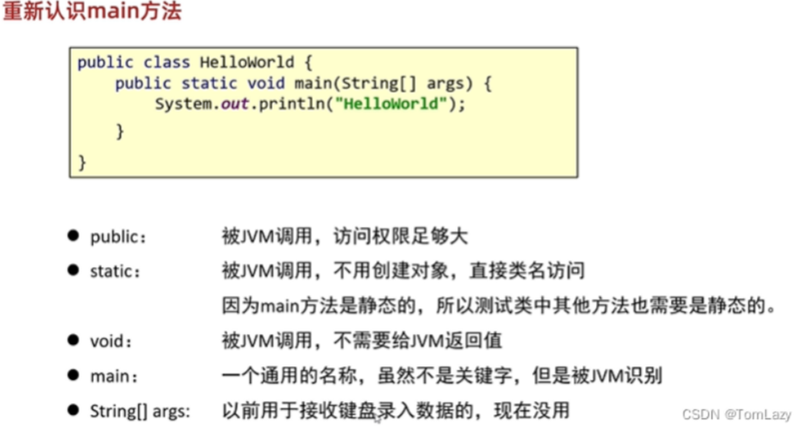


# 继承

1. 封装

​	对象代表什么，就得封装对应的数据，并提供数据对应的行为。

但随着封装类越来越多，相应类中重复的代码也越来越多，为了方便复用，我们可以把相同的方法代码写到第三个类中：（这就是继承的由来）。

## 继承的定义

* Java中提供一个关键字`extends`，用这个关键字，我们可以让一个类和另一个类建立起继承关系。

```java
public class Student extends Person{}
```

* Student称为子类（派生类），Person称为父类（基类或超类）。


继承的优点：

1. 提高代码的复用性
2. 子类在父类的基础上可以增加其他的功能，使子类更强大。


继承的特点：

* Java只支持单继承，不支持多继承，但支持多层继承。

* Java中所有的类都直接或间接继承自`Object`类。**`Object`类是Java中所有类的根类**，它位于Java类层次结构的顶部。即使在没有显式指定父类的情况下，Java编译器也会自动将类默认地继承自`Object`类。
* ***子类只能访问父类中非私有的成员***。


## 继承的内存图

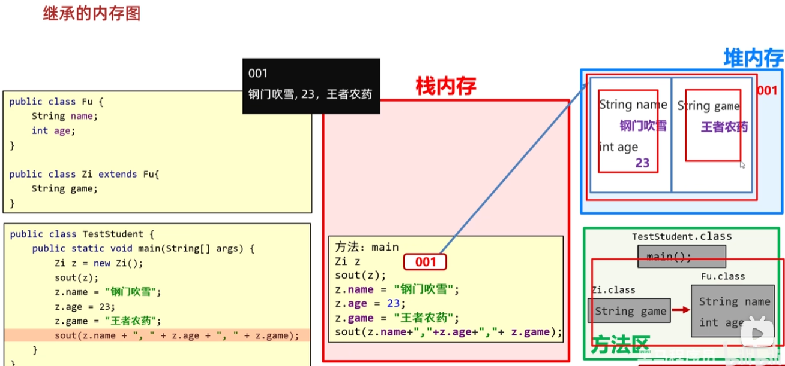

类继承的内存加载与之前有两点不同：

1. 在方法区中加载字节码文件时，会把父类的字节码文件也加载进去。
2. 在创建对象时，堆内存中有一部分空间是保存从父类继承的成员变量，一部分保存子类中的成员变量。


## 子类到底能继承父类中的哪些内容（重点）

1. **成员变量**私有和非私有都能被继承，但私有的成员变量不能直接访问使用。

2. 父类的**构造方法**不能被子类继承


3. **成员方法**是否可以被继承？

引入概念：**虚方法表**

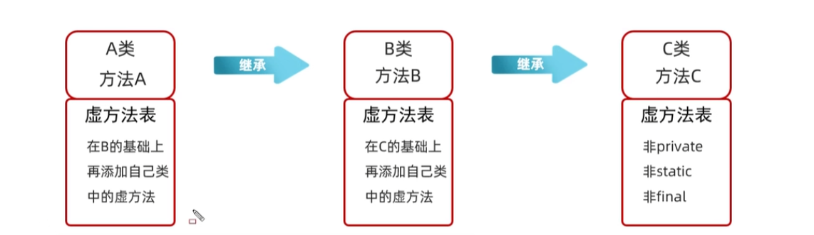

java从最顶级的父类开始设立了一个**虚方法表**，将这个类中经常调用的方法（非`private`，非`static`，非`final`）单独抽取出来放到虚方法表中。继承的时候父类C会把自己的虚方法表交给子类B，子类B会在父类C的虚方法表中添加自己的虚方法，当子类A继承B时，将虚方法表再传给子类A。以此类推。

note：**方法重写**的关键点就在虚方法表中。

**只有父类中的虚方法（非`private`，非`static`，非`final`）才可以被子类继承。**


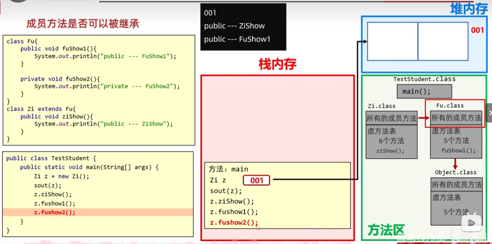


## 继承中成员变量的访问特点

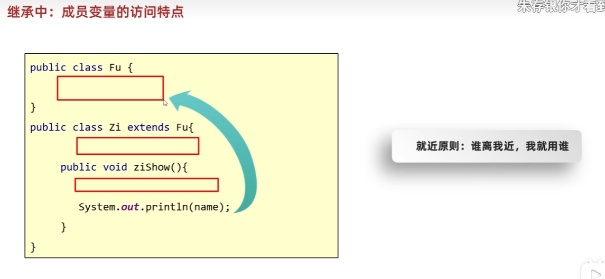

示例： 变量名，this.变量名，super.变量名 的使用区别

```java
public class Fu{
    String name = "Fu";
}

public class Zi extends Fu{
    String name = "Zi"; //没有显式修饰符的成员变量对同一包内的所有类可见。包访问级别。
    public void ziShow(){
        String name = "ziShow";
        System.out.println(name); //就近原则
        System.out.println(this.name); //this关键字使用本类中成员变量
        System.out.println(super.name);//super 使用父类中成员变量
    }
}
```

在子类中最多使用一个`super`，两个以上会报错。

**Tips**：java中每个源文件只能有一个public类，并且类名是文件名。


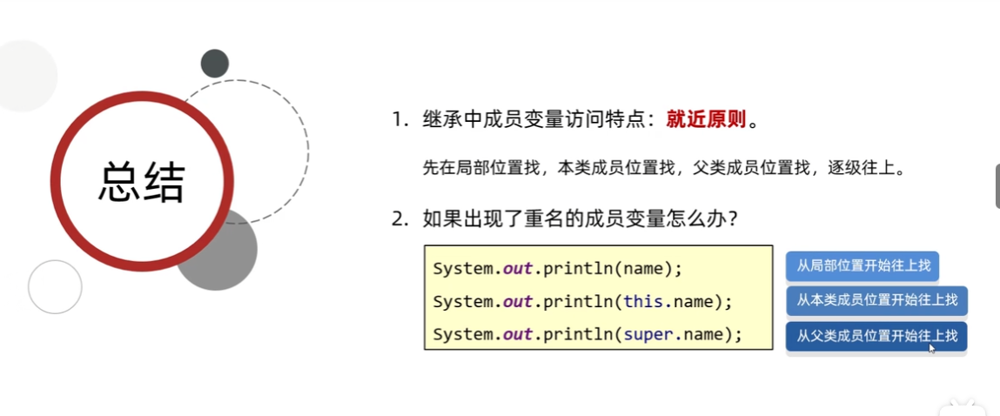

父类中私有的成员变量可以被子类继承，但不能直接访问。可以通过父类提供的Set/Get方法，子类就能够间接地访问并修改父类的私有成员变量。

## 继承中成员方法的访问特点

**方法的重写**

子类的方法与父类的方法重名，则会重写父类的方法。

`@Override` **重写注解**

1. 注解用于给java虚拟机看，`@Override` 是放在重写后的方法上，校验子类重写时语法是否正确。
2. 加上注解后如果有红色波浪线，表示语法错误。
3. 建议重写方法都加上`@Override` ，代码安全，优雅！


**方法重写的本质**

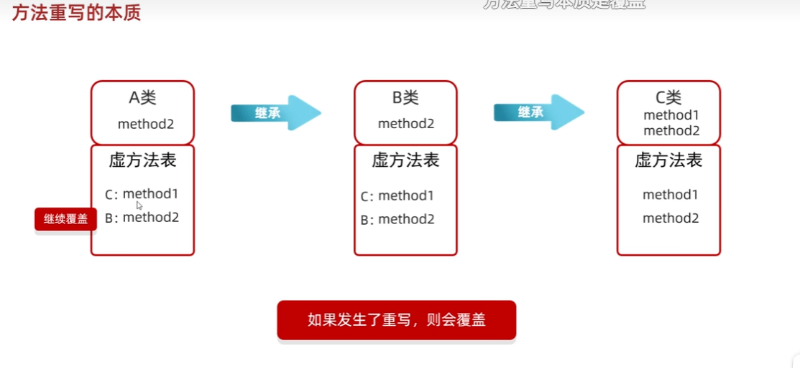

子类覆盖了从父类中继承下来的虚方法表的方法，这就是方法重写。


**方法重写注意事项和要求**

1. 重写方法的名称、形参列表必须与父类中的一致。
2. 子类重写父类方法时，**访问权限**必须<u>*大于等于*</u>父类（暂时了解：空着不写 < protected < public）

3. 子类重写父类方法时，返回值类型子类必须小于等于父类。
4. 一二三点总结：**建议：重写的方法尽量和父类保持一致。**
5. 只有被添加到虚方法表中的方法才能被重写。


**小结：**

**继承中成员方法的访问特点**

1. 就近原则
1. this调用：本类
2. super调用：直接找父类
3. 方法重写


## 继承中构造方法的访问特点

* 父类中的构造方法不会被子类继承
* ***<u>子类中所有的构造方法默认先访问父类中的无参构造，再执行自己。</u>***
  * 为什么？
    * 子类在初始化的时候，有可能会使用到父类中的数据，如果父类没有完成初始化，子类将无法使用父类的数据。
  * 怎么调用父类构造方法的？
    * 子类构造方法的第一句默认都是：`super()`，*<u>不写也存在</u>*，且必须在第一行。
    * 如果想调用父类有参构造，必须手动写`super()`进行调用。

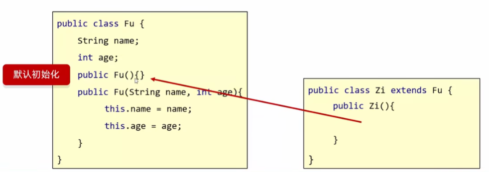

```java
public class Student extends Person {
    public Student() {
        super();  //'super()' must be first statement in constructor body
        System.out.println("Student no auguments constructor");
    }

    public Student(String name, int age) {
        super(name, age); //调用父类的带参构造
        System.out.println("Student auguments constructor");
    }

}
```


**小结：**

1. 继承中构造方法的访问特点是什么？
   * 子类中不能继承父类的构造方法，但是可以通过super调用。
   * 子类构造方法的第一行，有一个默认的super();
   * 默认先访问父类中无参的构造方法（就是super()语句的作用），再执行自己。
   * 如果想要调用父类的有参构造，必须手动书写，即`super(name,age);`


**this、super使用总结：**

* this：理解为一个变量，表示当前方法调用者的地址值；
  * 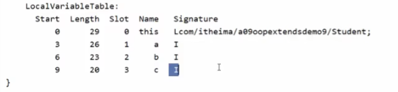
  * this在类中被视作一个局部变量
* super：代表父类存储空间

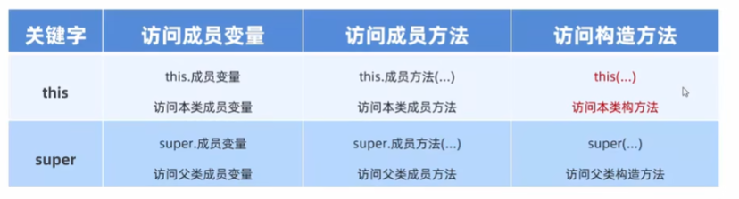


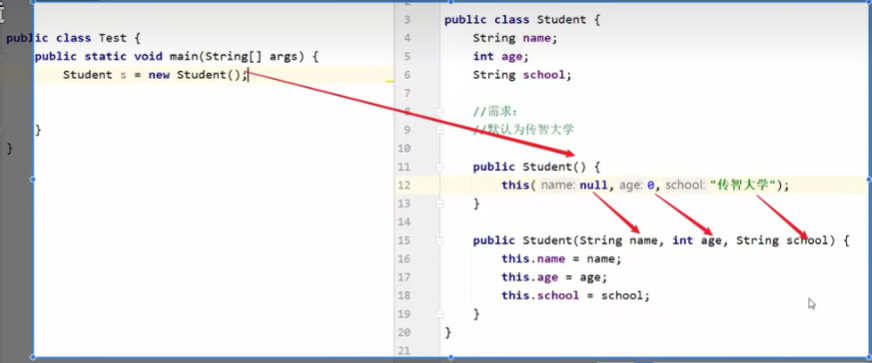

这里的`this()`表示调用本类其他构造方法。

用处：给一些数据做默认值的时候。


# 多态

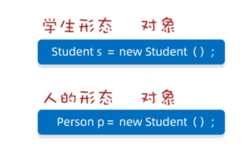

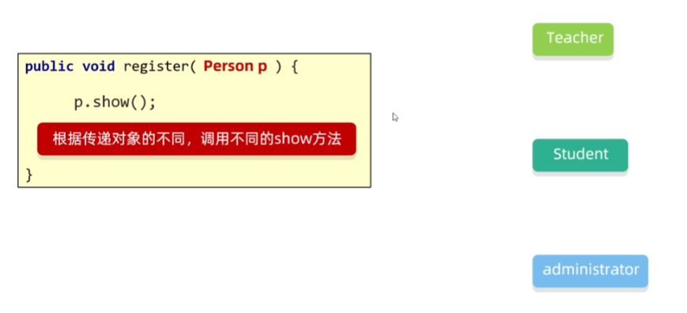

**什么是多态？**

同类型的对象，表现出的不同形态。

**多态的表现形式**

*父类对象 对象名称 = 子类对象；*

**多态的前提**

* 有继承/实现关系；
* 有父类引用指向子类对象； `Fu f = new Zi();`
* 有方法重写 （根据不同的对象使用同名的方法）

***如果看到一个方法的参数是类名，那么就可以传递这个类的所有子类到这个方法中。***

> 即 使用父类型作为参数，就可以接收所有子类对象。


## 多态中调用成员的特点

* 调用成员变量：编译看左边（<u>父类中有无这个成员变量</u>），运行也看左边（<u>父类的成员变量</u>）
* 调用成员方法：编译看左边（<u>父类有无这个成员方法</u>），运行看右边（<u>使用子类重写的成员方法</u>）


## 多态的优势

* 在多态的形势下，右边对象可以实现解耦合，便于拓展和维护。

```java
Person p = new Student();
p.work;    //业务逻辑发生改变时，后续代码无需修改
```

* 定义方法的时候，**使用父类型作为参数，可以接收所有子类对象**，体现多态的扩展性与便利。


## 多态的弊端

* **不能调用子类的特有功能**，在编译时会先检查左边父类中有没有这个方法，如果没有直接报错。

解决方案： 将调用者变回子类类型就可以了。

```java
Dog d = (Dog) a; //强制类型转换（大变小）
```


类型转换标准代码：

```java
if(a instanceof Dog){   //在类型转换前加了一个判断
	Dog d = (Dog) a;
	d.method();
}


//JDK 14 新特性：将判断和强制转换合在一起写
if(a instanceof Dog d){
    d.method();
}

```


## 类的强制类型转换能解决什么问题？

* 可以使对象转换为真正的子类类型，从而调用子类独有功能。
* 转换类型与真实对象类型不一致会报错。
* 转换的时候用`instanceof`关键字进行判断。


# 细节性知识点

## 包

包就是文件夹。用来管理各种不同功能的Java类，方便后期代码维护。不同功能的Java类应该放在不同的包中。

* 包名的规则： 公司域名反写+包的作用，需要**全部英文小写**，见名知意。如：com.itheima.domain
* 全类名：包名+类名

使用`import` 使用不同包下的类：

```java
import com.itheima.domain.Student;

public class Test{
    public static void main(String[] args){
        Student s = new Student();
    }
}
```


**使用导包的情况：**

* 使用同一个包中的类时，不需要导包。
* 使用`java.long`包中的类时，不需要导包。
* 其他情况都需要导包
* 如果同时使用两个包中的同类名，需要使用***全类名***：`com.itheima.domain.Student s = new com.itheima.domain.Student() `

## final 关键字

`final`修饰

* 方法：表明该方法是**最终方法**，不能被<u>重写</u>。
* 类：表明该类是**最终类**，不能被<u>继承</u>。
* 变量：叫做**常量**，<u>只能被赋值一次</u>。  

### 常量

常量的命名规范：

* 单个单词：全部大写
* 多个单词：全部大写，单词之间用下划线隔开。

**细节：**

* final 修饰的变量是基本数据类型：那么变量存储的**数据值**不能发生改变。

* final 修饰的变量是引用数据类型：那么变量存储的**地址值**不能发生改变，对象内部可以发生改变。


## 权限修饰符

* 权限修饰符：是用来控制一个成员能够被访问的范围的。
* 可以修饰 成员变量，方法，构造方法，内部类。

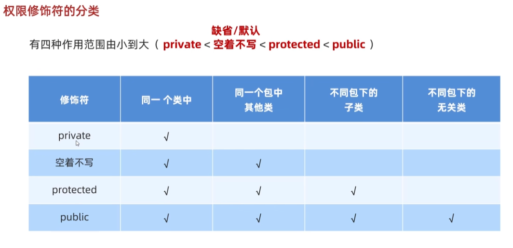\

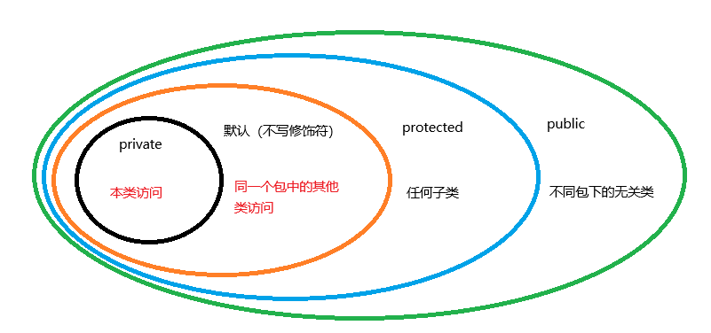

*“不同包下的子类”是指一个类继承自另一个类，而这两个类位于不同的包中。*

权限修饰符的使用规则：

实际开发中，一般只用`private`和`public `

* 成员变量私有
* 方法公开

**特例**： 如果方法中的代码是抽取其他方法中 共性代码，这个方法一般也私有。


**忽然理解**：protected修饰符 在*同一个包中的类* 和 *其他包中的子类* 可以调用。<u>但是其他包中的子类实例化之后的对象不能调用</u>。

## 代码块

* 局部代码块
* 构造代码块
* 静态代码块


### 局部代码块

定义了变量的生存周期，出了局部代码块，变量就从内存中消失了。


### 构造代码块

**写在成员位置的代码块**

1. 作用：**可以把多个构造方法中重复的代码抽取出来。**
2. 执行时机：我们在创建本类对象的时候会先执行构造代码块再执行构造方法。构造代码块先于构造方法执行。 

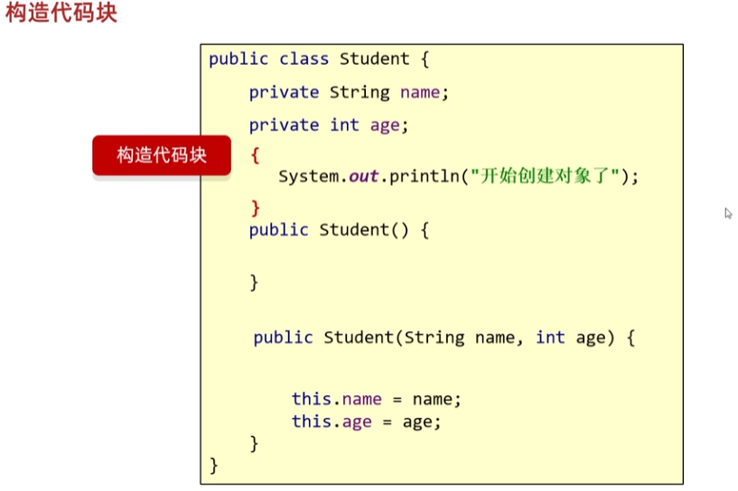

这种写法不够灵活。


新写法：

1. 使用`this`调用本类的其他构造函数。

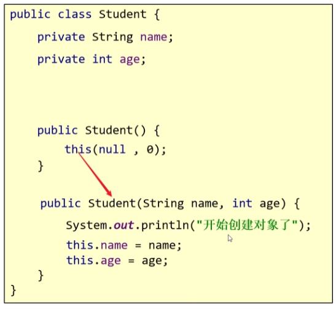

2. 把重复的代码抽取成一个方法，在构造函数中调用即可。

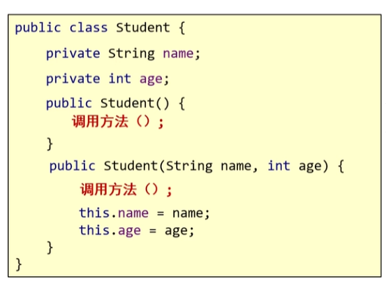

### 静态代码块 (重点)

格式：static{}

特点：需要通过static关键字修饰，随着类的加载而加载，并且自动触发，**只执行一次**。

用处：想要进行**数据初始化**，并且数据初始化只想执行一次，就把数据初始化的代码写在静态代码块中就行。

```java
static {
        System.out.println("静态代码块执行");
        x = 10;
    }
```


# 抽象类和抽象方法

解决子类不重写父类方法的问题，使子类强制重写父类的方法，同时也强制子类必须按照这种格式进行重写。

* 抽象方法：将共性的行为（方法）抽取到父类之后。

  ​                 由于每一个子类执行的内容是不一样的，

  ​					所以，在父类中不能确定具体的方法体。

  ​					该方法就可以定义为抽象方法。

* 抽象类：如果一个类中存在抽象方法，那么该类就必须声明抽象类。


## 抽象类和抽象方法的定义格式

* 抽象方法的定义格式：

```java
public abstract 返回值类型 方法名(参数列表); //无方法体
```


## 抽象类和抽象方法的注意事项

* 抽象类不能实例化（不能创建对象）。
* 抽象类中不一定有抽象方法，有抽象方法的类一定是抽象类。
* 抽象类可以有构造方法。作用：当创建子类对象时（继承抽象类并重写抽象方法），给属性进行赋值的。
* 抽象类的子类
  * 要么重写抽象类中的所有抽象方法。 （使子类强制重写父类中的抽象方法）
  * 要么是抽象类。（一般不用）


# 接口

接口就是一种规则，是对行为的抽象。

抽象类表示这一类事物，而接口表示行为。

举个例子：

兔子、青蛙、狗是动物类的子类。青蛙、狗会游泳，但是兔子不会游泳。那这个游泳行为就不能写在父类的成员方法中，这种情况，可以给游泳单独写个**接口**。

## 如何定义一个接口

接口的定义和使用

* 接口用关键字`interface`来定义

  ```java
  public interface 接口名{}
  ```

* **接口不能实例化**

* **接口和类之间是实现关系**，通过`implements`关键字表示。

  ```java
  public class 类名 implements 接口名{}
  ```

* 接口的子类（实现类）
  * 要么重写**接口中的所有抽象方法**
  * 要么是抽象类

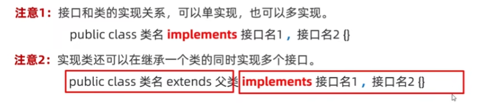


## 接口中成员的特点

* 成员变量

  * 只能是常量
  * 默认修饰符：public static final (接口里的成员变量都是常量，所以用final修饰；加入static可以使用 接口名.常量 名访问接口的成员变量；public 在所有地方都可以使用接口中的成员变量)

* 构造方法

  没有

* 成员方法

  * 只能是抽象方法
  * **默认**修饰符：public abstract   （不用手动添加，Java自动添加）
  * JDK7以前：接口中只能定义抽象方法
  * JDK8的新特性：接口中可以定义有方法体的方法
  * JDK9新特性：接口中可以定义私有方法

## 接口和类之间的关系

* 类和类的关系

  **继承**关系，只能单继承，不能多继承，但是可以多层继承。

* 类和接口的关系

  **实现**关系，可以单实现，也可以多实现，还可以在继承一个类的同时实现多个接口。

  * 实现多个接口需要把多个接口里的抽象方法全部重写，但是如果多个接口里有重名的抽象方法怎么办？
    * 只需要重写一次就可以，重写这一次把多个接口里的所有同名抽象方法都重写了。

* 接口和接口的关系

​		继承关系，可以单继承，也可以多继承。

​		**如果实现类是实现最下面的子接口的话，就需要重写所有的抽象方法。**


补充：接口还可以作为**<u>参数和返回类型</u>**。接口可以用于方法参数类型，使得方法能够接受任何实现了该接口的对象。


# 内部类

类的五大成员：

属性、方法、构造方法、代码块、内部类。


什么是内部类？

在一个类里面，再定义一个类。

举例：在A类的内部定义B类，B类就被称为内部类。

```java
public class Outer{   //外部类
	public class Inner{  //内部类
	 
	}
}
```

跟外部类和内部类都无关的类称为**外部其他类**。

内部类表示的事物是外部类的一部分；

内部类单独出现没有任何意义。

内部类的访问特点：

* 内部类可以直接访问外部类的成员，包括私有。
* 外部类要访问内部类的成员，必须创建对象。 


内部类的分类：

1. 成员内部类 （了解）
2. 静态内部类 （了解）
3. 局部内部类 （了解）
4. 匿名内部类 （掌握）

## 成员内部类

* 写在成员位置的，属于外部类的成员。
* 成员内部类可以被一些修饰符所修饰，比如：`private`,默认（空着不写），`protected`，`public`，`static`(静态内部类)等
* 在成员内部类里面，JDK16之前不能定义静态变量，JDK16开始才可以定义静态变量。


### 创建成员内部类的对象（两种方式）

方式一：

​		在外部类中编写方法，对外提供内部类的对象。（适用于成员内部类是被`private`修饰的情况）

```java
//外部类中 提供内部类对象的方法
public Inner getInstance(){
    return new Inner;
}

//在测试类中获取内部类的对象

Outer o = new Outer();
Object inner  = o.getInstance(); //因为Inner类名在外部不能直接使用，因此使用Inner的父类类型（没有父类就默认继承Object）形成一个多态。

//或者直接使用方法获取的对象
System.out.println(o.getInstance()); 
```


方式二：

​		直接创建格式：外部类名.内部类名  对象名 = 外部类对象.内部类对象

```java
Outer.Inner oi = new Outer().new Inner()   //Inner 是 Outer 中的内部类
```

### 成员内部类如何获取外部类的成员变量

`Outer.this.a`

```java
public class Outer{
    private int a = 10;
    
    class Inner{
        private int a = 20;
        
        private void show(){
            int a = 30;
            
            System.out.println(Outer.this.a); //10
            System.out.println(this.a);  //20
            System.out.println(a); //30 
        }
    }
}
```


外部类和内部类在内存中是两个独立的字节码文件。

 

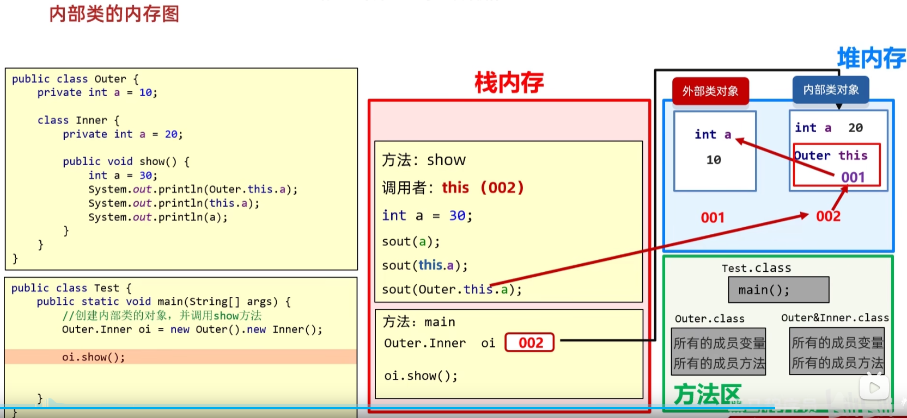

在堆内存中的内部类对象中保存有外部类的this。


## 静态内部类

静态内部类也是成员内部类中的一种。

内部类被`static`修饰。

* 静态内部类**只能访问外部类中的静态变量和静态方法**，如果想要访问非静态的需要创建对象。（静态只能访问静态，访问非静态需要创建对象）


### 创建静态内部类对象的格式

```java
外部类名.内部类名 对象名 = new 外部类名.内部类名();  //创建成员内部类需要外部对象名.内部对象名；而创建静态内部类只需要外部类名.内部类名
```


调用内部类中非静态方法的格式： 先创建对象，用对象调用

调用静态方法的格式：`外部类名.内部类名.方法名();`（不需要创建对象）


## 局部内部类

1. ***将内部类定义在方法里面就叫局部内部类***，类似于方法里的局部变量。

2. 外界是无法直接使用，需要在方法内部创建对象并使用。

   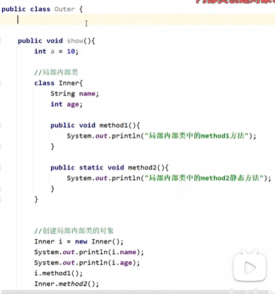

3. 该类可以直接访问外部类的成员，也可以访问方法内的局部变量。


## 匿名内部类（重要）

匿名内部类本质上就是隐藏了名字的内部类。

**格式：**

```java
new 类名或者接口名(){  //如果是类就是继承关系，如果是接口就是实现关系
	重写方法；
}；
```


总结：

1. 什么是匿名内部类？

​		隐藏了名字的内部类，可以写在***成员位置***，也可以写在***局部位置***。

2. 匿名内部类的格式？

   看上面

3. 格式的细节

   包含了继承或实现，方法重写，创建对象。

   > 整体就是一个类的子类对象或者接口的实现类对象。

4. 使用场景

   当*<u>方法的参数是接口或者类</u>*时，

   以接口为例，可以传递这个接口的实现类对象。

   如果*<u>这个实现类只使用一次</u>*，就可以用***匿名内部类***简化代码。

==**总结：**==

1. **简化代码**

当需要实现一个接口或继承一个类，并且该实现只会使用一次时，可以通过匿名内部类代替单独创建一个新类的做法，从而减少代码量。

2. **避免创建多个类文件**

匿名内部类是**局部类**，不会单独生成命名的类文件，适合临时性需求。

3. **快速实现接口或继承类**

用于实现接口、抽象类或父类中的方法，常见于**回调函数**、**事件监听器**等场景。


==问：匿名内部类 实现的接口中必须只有一个抽象方法吗==

不，**匿名内部类**实现的接口不一定必须只有一个抽象方法。它可以实现任意接口，无论接口中有多少个抽象方法。不过，这里需要区分以下两种情况：

**1. ==匿名内部类==实现的接口**

* **接口中的所有抽象方法都必须实现。** 匿名内部类没有类名，因此它需要一次性实现接口中的所有抽象方法。
  如果接口中有多个抽象方法，匿名内部类就需要实现所有这些方法。

**2. ==Lambda 表达式==的限制（与函数式接口有关）**

如果你希望用**Lambda 表达式**替代匿名内部类，那实现的接口就必须是**函数式接口**。

（即，接口中只能有一个抽象方法，通常用 `@FunctionalInterface` 注解标记）。这是因为 Lambda 表达式的语法只支持实现一个抽象方法。

> * 匿名内部类可以实现任意接口，无论抽象方法数量。
>
> * Lambda 表达式只能用于**函数式接口**，即只有一个抽象方法的接口。
