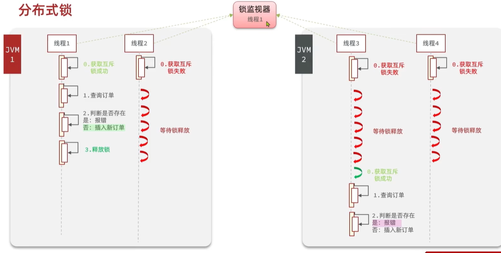

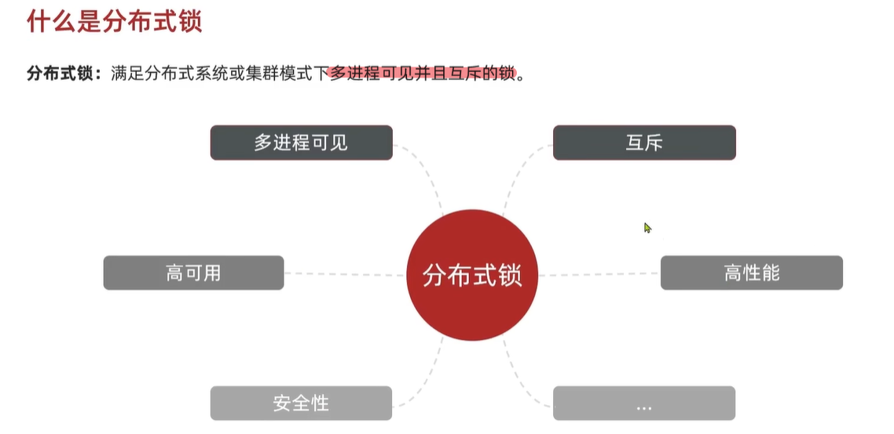

# 分布式锁的实现

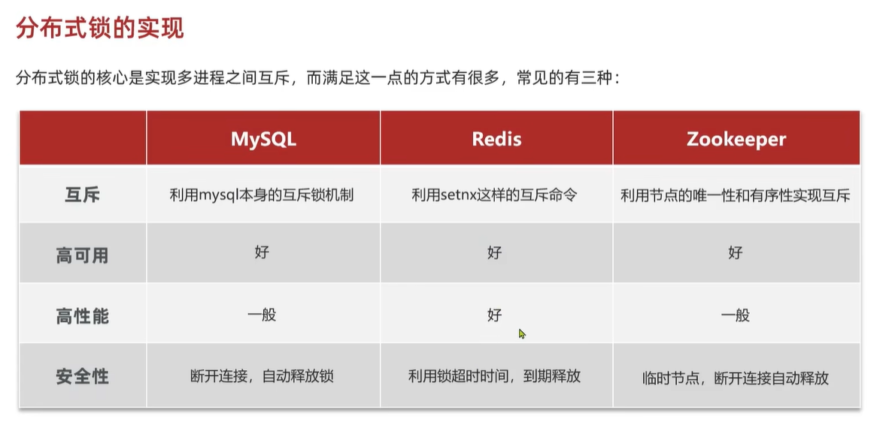

# 基于Redis的分布式锁

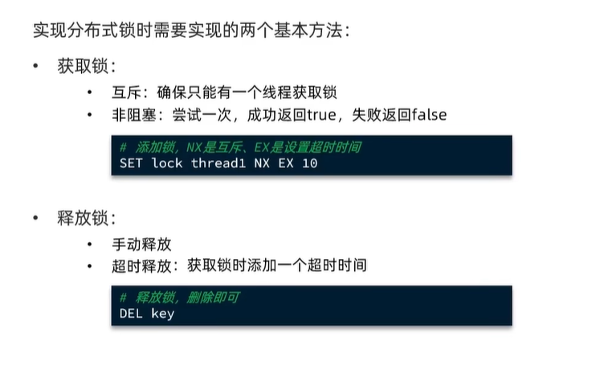

在 Redis 中，`nil` 是一种特殊的返回值，表示**空值**或者**不存在的值**。

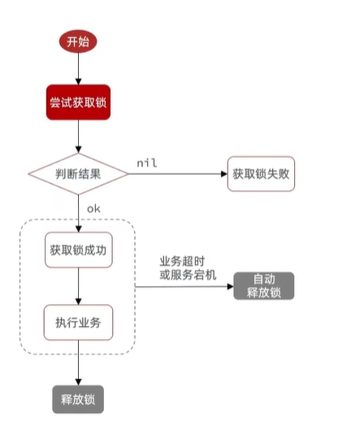

# Redis分布式锁误删问题

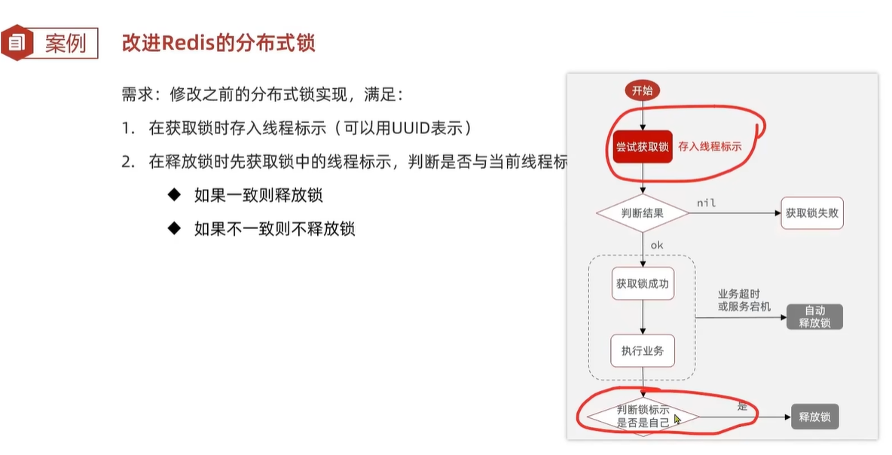

* 使用UUID存入线程提示，UUID与线程ID结合


# 分布式锁的原子性

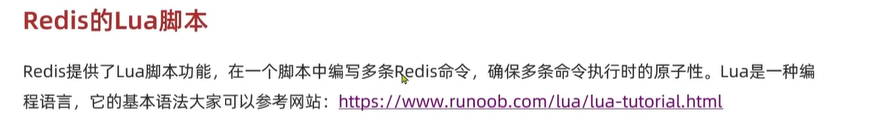

 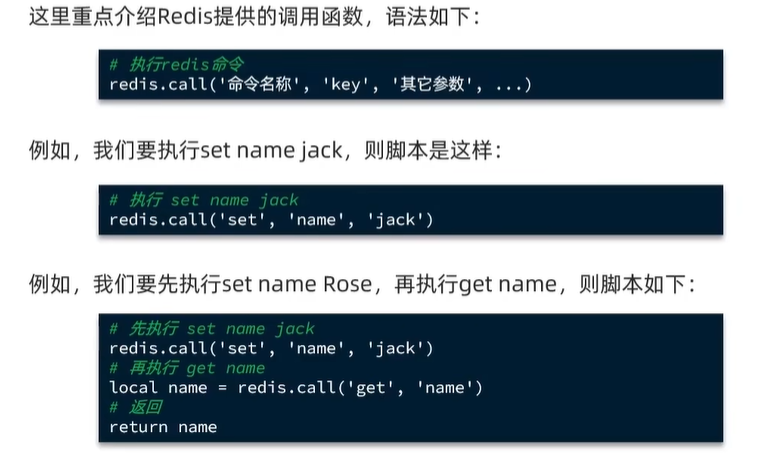

## 执行脚本

 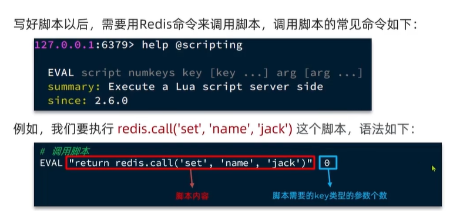

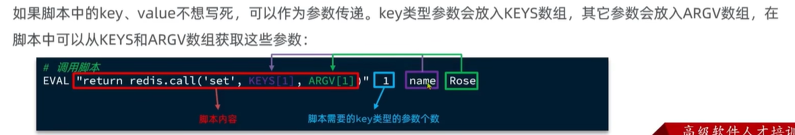

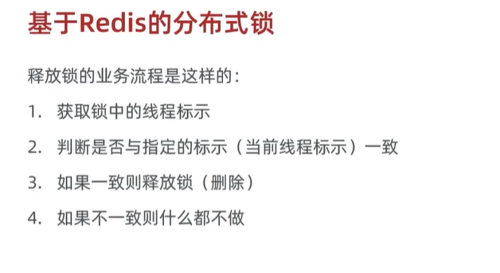

用Lua脚本写这段逻辑

```lua
--锁的key
local key = KEYS[1]

--当前线程标识
local threadId = ARGV[1]

--get key
local id = redis.call('get',key)

--比较线程标识与锁中的标识是否一致
if(id==threadId) then
    --释放锁
   return redis.call('del',key)
end

return 0
```


# Java调用Lua脚本

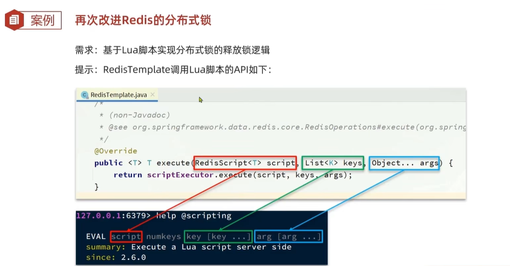

 

```java
stringRedisTemplate.execute(UNLOCK_SCRIPT, Collections.singletonList(key),threadId);
```


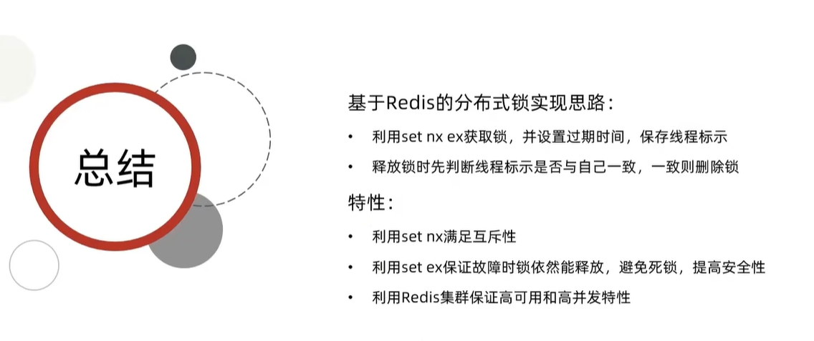

# 基于redis的分布式锁优化

基于setnx的分布式锁存在下面的问题：

* 不可重入：同一线程无法多次获取同一把锁。
* 不可重试：获取锁只尝试一次就返回false，没有重试机制。
* 超时释放
* 主从一致性

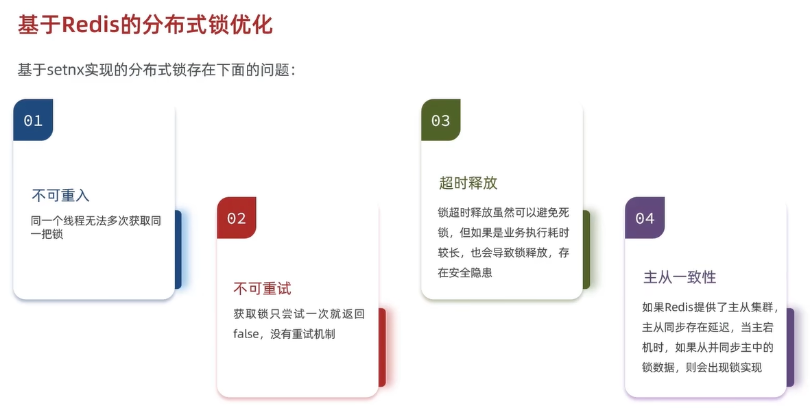

Redisson可以解决这些问题

# Redisson

在Redis基础上实现的分布式工具的集合。

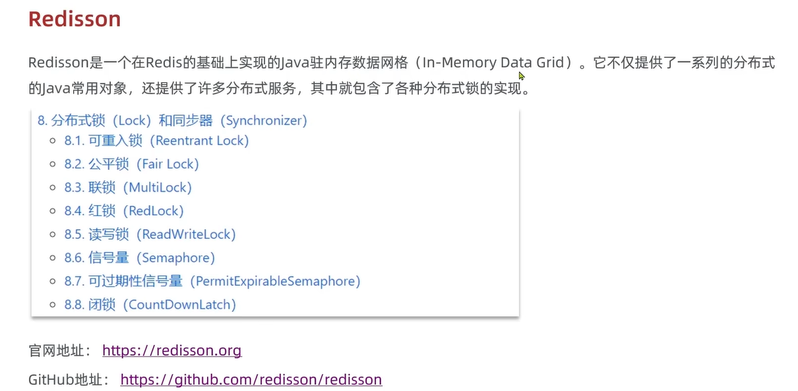


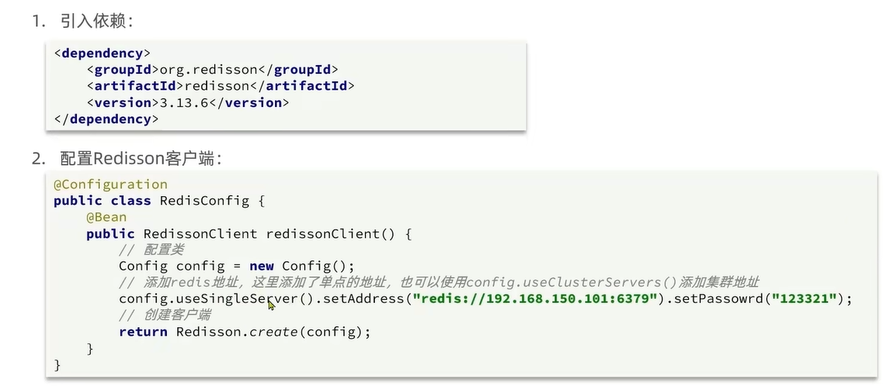

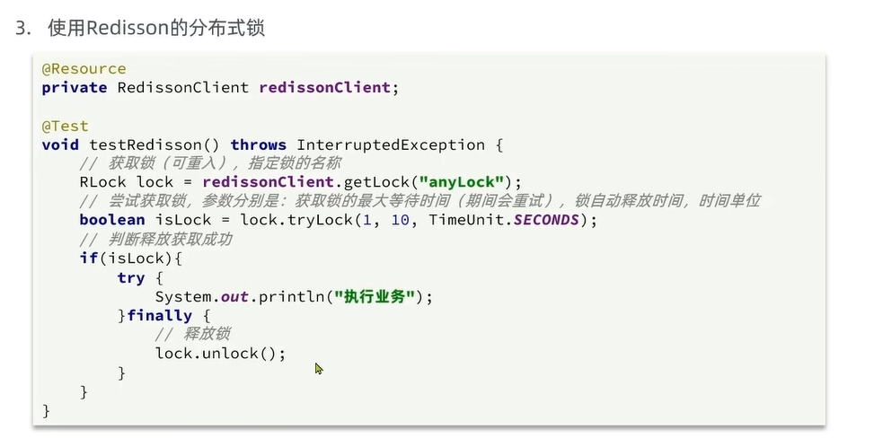

# Redission可重入锁原理

==**重入**：一个线程两次获取锁==

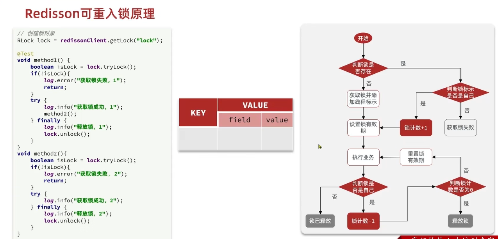

使用Lua脚本实现来确保获取锁和释放锁的原子性。

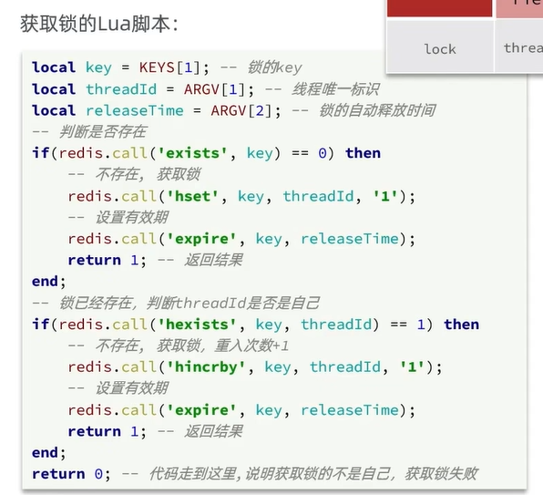

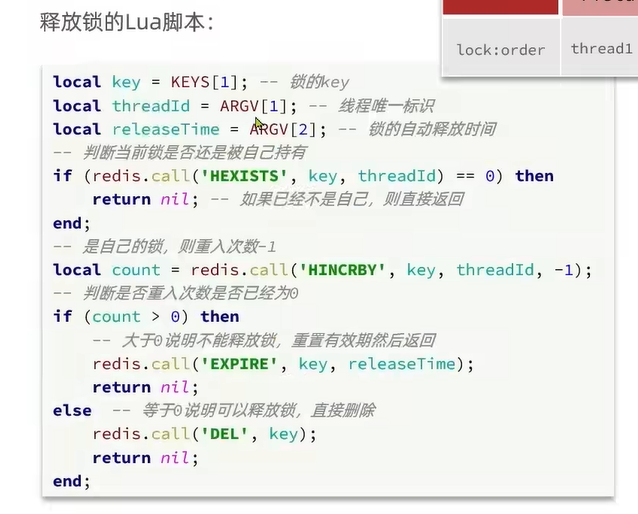

Redisson中的锁就是这样实现的。


[TOC]

# Redisson的锁重试和WatchDog机制

==消息订阅==

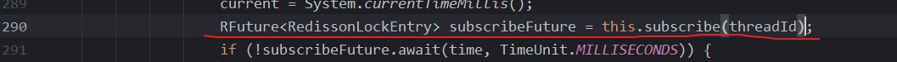


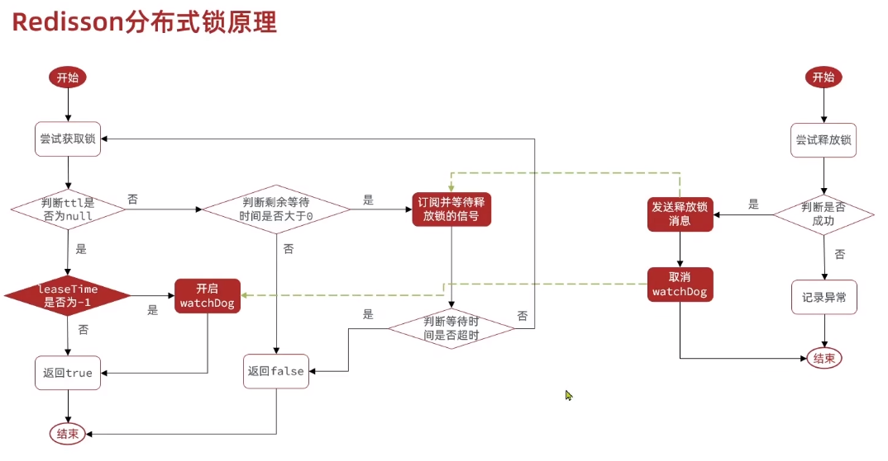

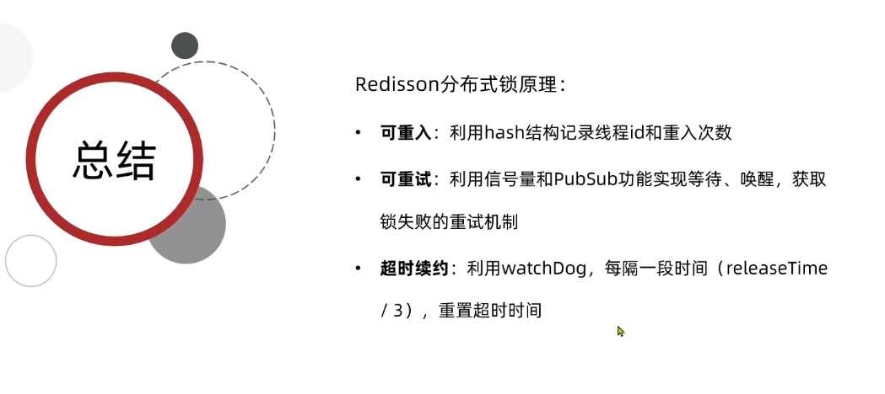

超时续约：确保锁是因为业务执行完释放，而不是因为阻塞释放。

# Redission的multiLock原理

解决==主从一致性问题==

一个主节点和多个从节点，主节点做增删改操作，从节点做查操作。

因此会存在主节点和从节点的数据一致性问题。


锁失效问题：

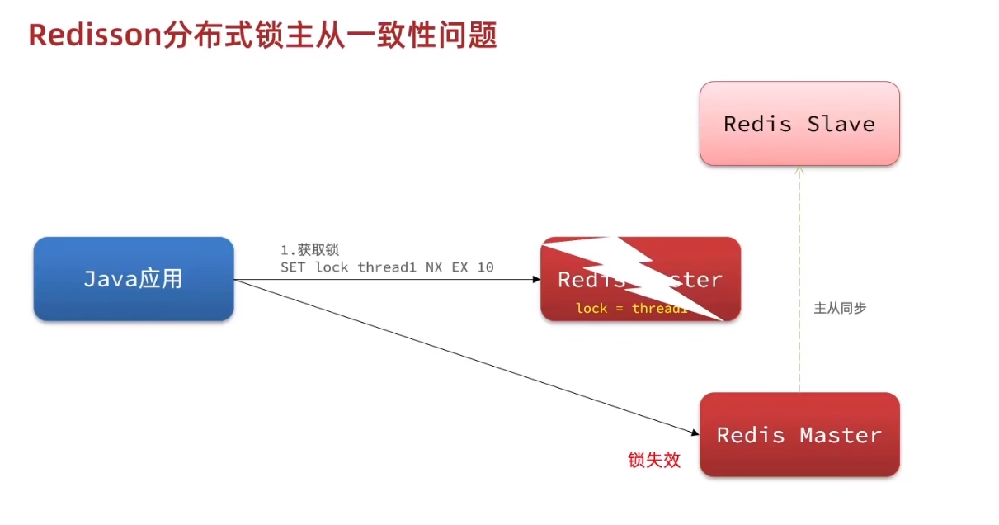

multiLock： 无主从节点，多个可重入锁的集合

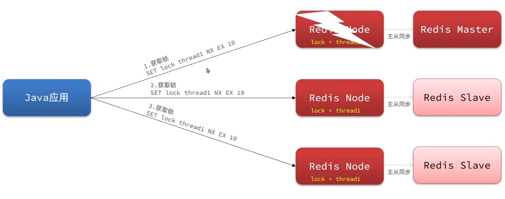

使用

docker创建多个redis容器

```
docker run --name redis-docker1 -d -p 6380:6379 redis
```

```
docker run --name redis-docker2 -d -p 6381:6379 redis
```


[TOC]

# 总结

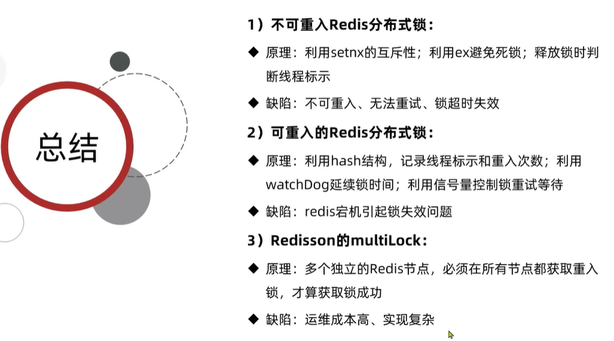

