[TOC]


#  1.预备知识

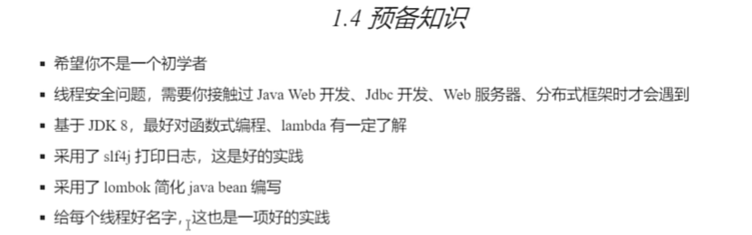

# 2.进程与线程

 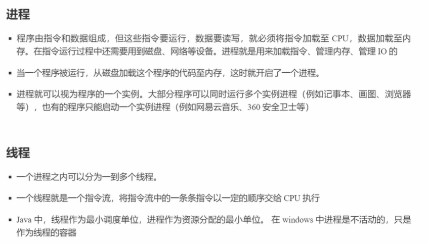

 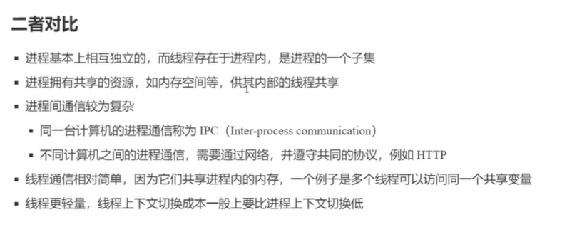


> 一个进程中可以有多个线程，多个线程共享进程的**堆**和**方法区 (JDK1.8 之后的元空间)\**资源，但是每个线程有自己的\**程序计数器**、**虚拟机栈** 和 **本地方法栈**。


## 异步调用

 

==多线程可以让方法变为异步==，比如读取磁盘文件，假设读取操作花费5s，如果没有线程调度机制，这5s调用者什么也做不了，其代码都得暂停...

> **JMH**（Java Microbenchmarking Harness）是一个用于在 Java 中进行 **微基准测试**（Microbenchmarking）的工具库。它由 **OpenJDK** 团队开发，旨在提供一种可靠且高效的方式来测试 Java 代码的性能，特别是在微观性能测试（即对单个操作或小块代码进行性能分析）方面。


## 结论

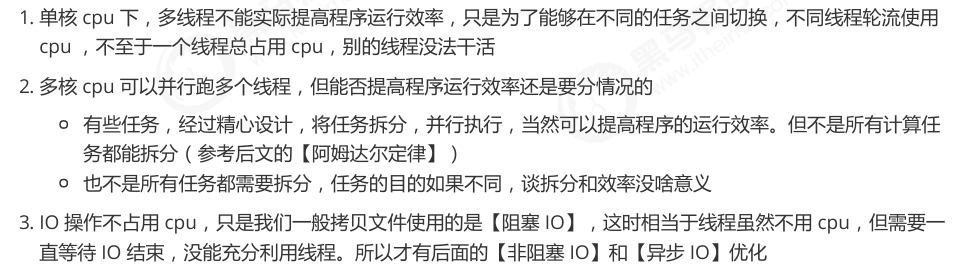


# 3 Java线程

* 创建和运行线程
* 查看线程
* 线程API
* 线程状态


## 3.1 创建和运行线程

java程序在一启动的时候就创建了主方法线程（主线程）。

创建线程的方法：

1. 直接使用`Thread`，重写Thread中的run方法
2. 实现Runnable中的run方法，作为参数传给Thread实例化
3. 实现Callable接口，传入FutureTask，再将FutureTask<>传入Thread


### 方法1

```java
@Slf4j(topic = "c.Test1")
public class Test1 {
    public static void main(String[] args) {
        Thread thread1 = new Thread("Thread"){
            @Override
            public void run(){
                log.debug("running");
            }
        };
//        thread1.setName("Thread");
        thread1.start();
    }
}
```


### 方法2

```java
@Slf4j(topic = "c.Test2")
public class Test2 {
    public static void main(String[] args) {
        Runnable runnable = new Runnable() {
            @Override
            public void run() {
                log.debug("running");
            }
        };

        Thread thread2 = new Thread(runnable);
        thread2.setName("Thread2");
        thread2.start();
    }
}
```


### 方法3

```java
@Slf4j(topic = "c.Test3")
public class Test3 {
    public static void main(String[] args) throws ExecutionException, InterruptedException {


//        Callable callable = new Callable<String>() {
//            @Override
//            public String call() throws Exception {
//                log.debug("Thread3");
//                return "Thread3";
//            }
//        };
        //因为Callable是函数式接口，所有可以使用lambda表达式化简


        FutureTask<String> futureTask = new FutureTask<>(()->{
            log.debug("Thread3");
            return "Thread3";
        });
        Thread thread3 = new Thread(futureTask,"thread3");
        thread3.start();
        System.out.println(futureTask.get());  //这个方法可以获取线程的返回值
    }
}
```


### 总结：

* 方法1 把线程和任务合并在了一起；方法2和3把线程和任务分开
* 方法3可以获取多线程的结果，前两种方法不行。
* 用 Runnable 更容易与线程池等高级 API 配合

## 3.2 线程运行的原理

### 栈与栈帧

Java Virtual Machine Stacks （Java 虚拟机栈）

* 每个栈由多个栈帧（Frame）组成，对应着每次方法调用时所占用的内存。

* 每个线程只能有一个活动栈帧，对应着当前正在执行的那个方法。


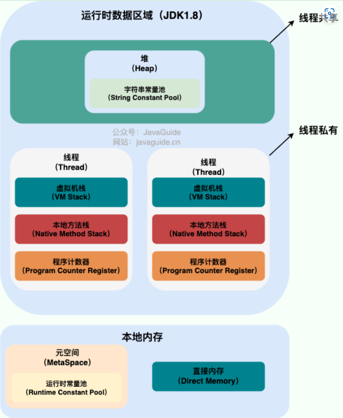

线程私有：**虚拟机栈**、**本地方法栈**、**程序计数器**。

共享 **堆**和**方法区**资源。

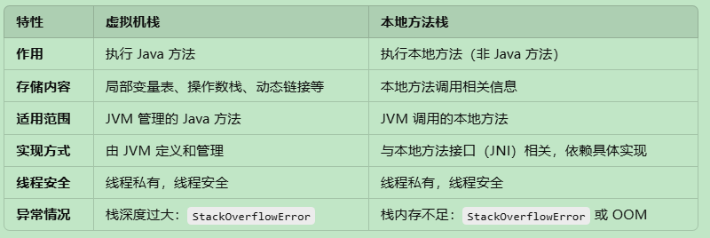

虚拟机栈中有多个栈帧，每个方法对应一个栈帧。


### 线程上下文切换

因为以下一些原因导致 cpu 不再执行当前的线程，转而执行另一个线程的代码。

以下原因会导致线程上下文切换

* 线程的cpu**时间片用完**
* **主动让出cpu**，线程自己调用了 sleep、yield、wait、join、park、synchronized、lock 等方法
* 垃圾回收，（应用线程会挂起，cpu使用权 从应用线程到垃圾回收线程）
* 有更高优先级的线程需要运行


当 Context Switch 发生时，需要由操作系统保存当前线程的状态，并恢复另一个线程的状态，Java 中对应的概念 就是程序计数器（Program Counter Register），它的作用是记住下一条 jvm 指令的执行地址，是线程私有的 

* **状态包括程序计数器、虚拟机栈中每个栈帧的信息**，如局部变量、操作数栈、返回地址等 

* Context Switch 频繁发生会影响性能


JVM 规范并没有限定线程模型，以 HotSopot 为例：

- Java 的线程是内核级线程（1:1 线程模型），每个 Java 线程都映射到一个操作系统原生线程，需要消耗一定的内核资源（堆栈）
- **线程的调度是在内核态运行的，而线程中的代码是在用户态运行**，所以线程切换（状态改变）会导致用户与内核态转换进行系统调用，这是非常消耗性能

Java 中 main 方法启动的是一个进程也是一个主线程，main 方法里面的其他线程均为子线程，main 线程是这些线程的父线程


## 3.3 线程中常用方法

### start与run

new 一个 `Thread`，线程进入了新建状态。调用 `start()`方法，会启动一个线程并使线程进入了就绪状态，当分配到时间片后就可以开始运行了。 `start()` 会执行线程的相应准备工作，然后自动执行 `run()` 方法的内容，这是真正的多线程工作。 但是，直接执行 `run()` 方法，会把 `run()` 方法当成一个 main 线程下的普通方法去执行，并不会在某个线程中执行它，所以这并不是多线程工作。


**总结：调用 `start()` 方法方可启动线程并使线程进入就绪状态，直接执行 `run()` 方法的话不会以多线程的方式执行。**

* 直接调用run方法是在主线程中执行了run，没有启动新的线程。
* 使用start是启动新的线程并使线程进入就绪状态，通过新的线程间接执行run中的代码。


### sleep与yield

**sleep**

1.  调用 sleep 会让当前线程从 Running  进入 Timed Waiting 状态（阻塞）

2. 其它线程可以使用  interrupt 方法打断正在睡眠的线程，这时 sleep 方法会抛出`InterruptedException`

   ```java
   t1.start();
   t1.interrupt();
   ```

3. 睡眠结束后的线程未必会立刻得到执行，处于就绪态，等待cpu分配。


**yield**

1. 调用yield让出cpu的使用权，从Running 变为 Runnable就绪状态。
2. 具体的实现依赖于操作系统的任务调度器。


**join**

等待线程运行结束。等待调用join()的线程对象结束。

```java
    static int r = 0;
    public static void main(String[] args) throws InterruptedException {
        test1();
    }
    private static void test1() throws InterruptedException {
        log.debug("开始");
        Thread t1 = new Thread(() -> {
            log.debug("开始");
            sleep(1);
            log.debug("结束");
            r = 10;
        });
        t1.start();
        t1.join();
        log.debug("结果为:{}", r);
        log.debug("结束");
    }

--运行结果--
16:37:36 [main] c.Test4 - 开始
16:37:36 [Thread-0] c.Test4 - 开始
16:37:37 [Thread-0] c.Test4 - 结束
16:37:37 [main] c.Test4 - 结果为:10
16:37:37 [main] c.Test4 - 结束
```


有时效的等待，join

```java
t1.join(1500);
```


###  interrupt 方法详解

打断 **sleep，wait，join** 的线程  ，这几个方法都会让线程进入阻塞状态

join的底层是wait。

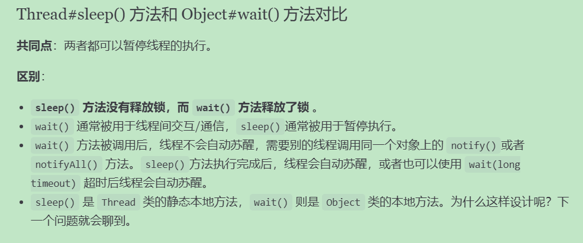

可以打断**阻塞状态**的线程，也可以打断**运行状态**的线程。


打断 sleep 的线程, 会清空打断状态。打断标记变为false。

打断正常运行的线程, 不会清空打断状态。


### 两阶段终止模式

指在一个线程T1中优雅地终结线程T2.

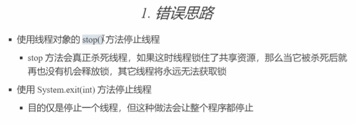

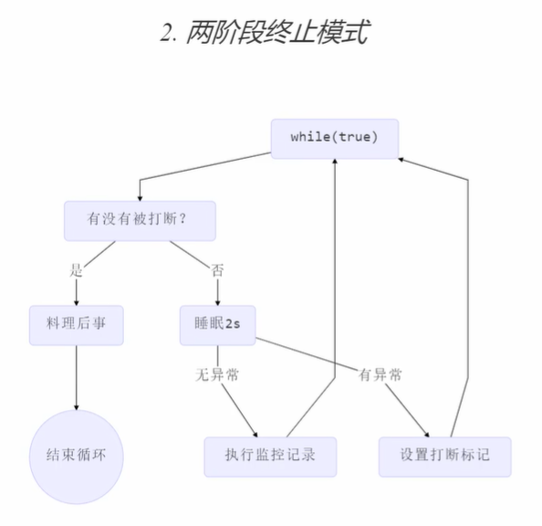

```java
@Slf4j(topic = "c.Test")
public class TwoPhaseInterrupt {
    public static void main(String[] args) throws InterruptedException {
        TwoPhaseTermination tpt = new TwoPhaseTermination();
        tpt.start();
        Thread.sleep(3500);
        tpt.stop();
    }

}
@Slf4j(topic = "c.TwoPhaseTermination")
class TwoPhaseTermination{
    private Thread monitor;

    //启动监控线程
    public void start(){
        monitor = new Thread(()->{
            while(true){
                Thread current = Thread.currentThread();
                if (current.isInterrupted()){
                    log.debug("料理后事");
                    break;

                }
                try {
                    Thread.sleep(1000);
                    log.debug("执行监控记录");
                } catch (InterruptedException e) {
                    e.printStackTrace();
                    //重新设置打断标记
                    current.interrupt();
                }
            }
        });
        monitor.start(); // 启动线程
    }

    //停止监控线程
    void stop(){
        monitor.interrupt();
    }
}
```

两个判断是否打断的方法：

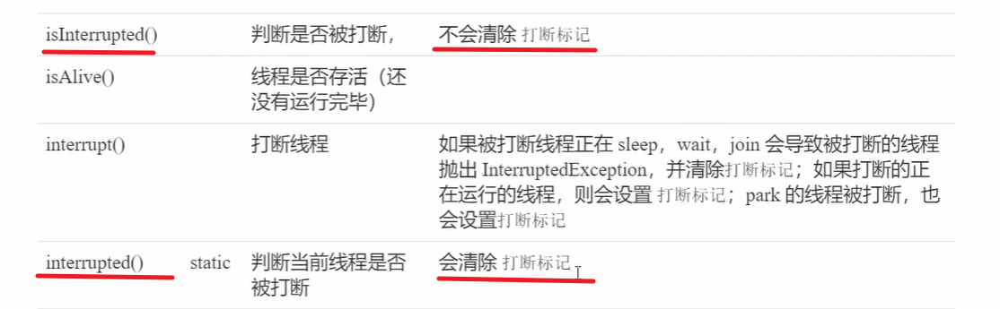


### 打断park线程

```
LockSupport.park();
```


* 打断 park 线程, 不会清空打断状态。
* 如果打断标记已经是 true, 则 park 会失效

> 可以使用  Thread.interrupted() 清除打断状态


## 3.4 主线程与守护线程

默认情况下，Java 进程需要等待所有线程都运行结束，才会结束。有一种特殊的线程叫做守护线程，只要其它非守护线程运行结束了，即使守护线程的代码没有执行完，也会强制结束。

**daemon**

`public final void setDaemon(boolean on)`：如果是 true ，将此线程标记为守护线程

线程启动前调用此方法.

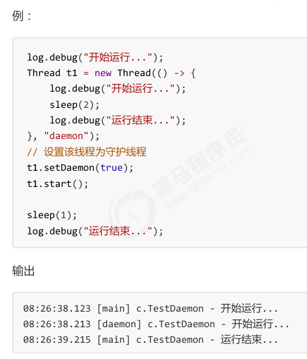

用户线程：平常创建的普通线程

守护线程：服务于用户线程，只要其它非守护线程运行结束了，即使守护线程代码没有执行完，也会强制结束。守护进程是**脱离于终端并且在后台运行的进程**，脱离终端是为了避免在执行的过程中的信息在终端上显示

说明：当运行的线程都是守护线程，Java 虚拟机将退出，因为普通线程执行完后，JVM 是守护线程，不会继续运行下去

>注意:
>
>* 垃圾回收器线程就是一种守护线程.
>* Tomcat 中的 Acceptor 和 Poller 线程都是守护线程，所以 Tomcat 接收到 shutdown 命令后，不会等 待它们处理完当前请求.


## 3.5 五种状态

### 线程调度

线程调度指系统为线程分配处理器使用权的过程，方式有两种：协同式线程调度、抢占式线程调度（Java 选择）

协同式线程调度：线程的执行时间由线程本身控制

- 优点：线程做完任务才通知系统切换到其他线程，相当于所有线程串行执行，不会出现线程同步问题
- 缺点：线程执行时间不可控，如果代码编写出现问题，可能导致程序一直阻塞，引起系统的奔溃

抢占式线程调度：线程的执行时间由系统分配

- 优点：线程执行时间可控，不会因为一个线程的问题而导致整体系统不可用
- 缺点：无法主动为某个线程多分配时间


Java 提供了线程优先级的机制，优先级会提示（hint）调度器优先调度该线程，但这仅仅是一个提示，调度器可以忽略它。在线程的就绪状态时，如果 CPU 比较忙，那么优先级高的线程会获得更多的时间片，但 CPU 闲时，优先级几乎没作用

说明：并不能通过优先级来判断线程执行的先后顺序


### 线程状态

进程的状态参考操作系统：创建态、就绪态、运行态、阻塞态、终止态

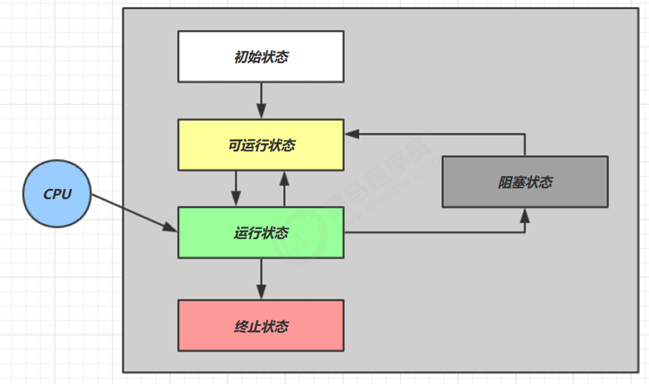

* 创建态: <u>仅是在语言层面创建了线程对象，还未与操作系统线程关联</u>
* 就绪态: <u>该线程已经被创建,等待分配cpu时间片.</u>
* 运行态: <u>*获取了cpu时间片正在运行.*</u>
* 阻塞态: <u>指线程或进程等待某个条件或资源时，无法继续执行的状态。</u>
  * 如等待IO操作
  * 等待锁
  * 在java中通过以下几种方法进入阻塞状态:
    * `sleep()`
    * `wait()`
    * `join()`

* 终止态: <u>表示线程已经执行完毕，生命周期已经结束，不会再转换为其它状态.</u>


## 3.6 六种状态

这是从 Java API 层面来描述的

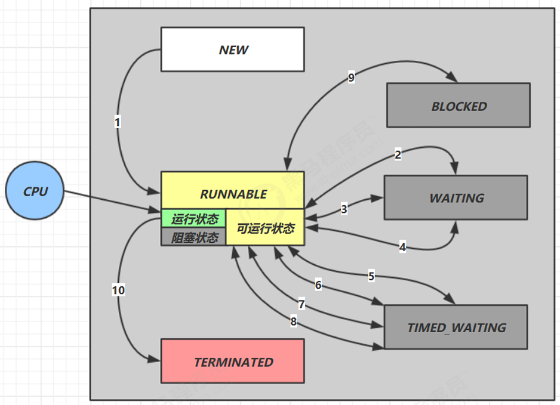

* `NEW`  线程刚被创建，但是还没有调用 ` start()` 方法 
* `RUNNABLE` 当调用了  `start()` 方法之后，注意，Java API 层面的  `RUNNABLE` 状态涵盖了 操作系统 层面的 【可运行状态】、【运行状态】和【阻塞状态】（由于 BIO 导致的线程阻塞，在 Java 里无法区分，仍然认为 是可运行）
*  `BLOCKED` ， `WAITING` ，  `TIMED_WAITING` 都是 Java API 层面对【阻塞状态】的细分，后面会在状态转换一节 详述.
* `TERMINATED` 当线程代码运行结束

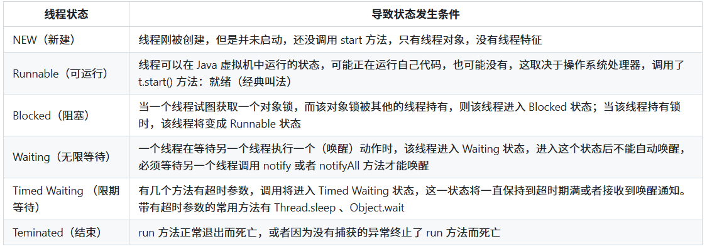

- NEW → RUNNABLE：当调用 t.start() 方法时，由 NEW → RUNNABLE

- RUNNABLE <--> WAITING：

  - 调用 obj.wait() 方法时

    调用 obj.notify()、obj.notifyAll()、t.interrupt()：

    - 竞争锁成功，t 线程从 WAITING → RUNNABLE
    - 竞争锁失败，t 线程从 WAITING → BLOCKED

  - 当前线程调用 t.join() 方法，注意是当前线程在 t 线程对象的监视器上等待

  - 当前线程调用 LockSupport.park() 方法

- RUNNABLE <--> TIMED_WAITING：调用 obj.wait(long n) 方法、当前线程调用 t.join(long n) 方法、当前线程调用 Thread.sleep(long n)

- RUNNABLE <--> BLOCKED：t 线程用 synchronized(obj) 获取了对象锁时竞争失败

****

[Thread#sleep() 方法和 Object#wait() 方法对比](#thread-sleep-方法和-object-wait-方法对比)

**共同点**：两者都可以暂停线程的执行。

**区别**：

- **`sleep()` 方法没有释放锁，而 `wait()` 方法释放了锁** 。
- `wait()` 通常被用于线程间交互/通信，`sleep()`通常被用于暂停执行。
- `wait()` 方法被调用后，线程不会自动苏醒，需要别的线程调用同一个对象上的 `notify()`或者 `notifyAll()` 方法。`sleep()`方法执行完成后，线程会自动苏醒，或者也可以使用 `wait(long timeout)` 超时后线程会自动苏醒。
- `sleep()` 是 `Thread` 类的静态本地方法，`wait()` 则是 `Object` 类的本地方法。为什么这样设计呢？下一个问题就会聊到。

***


[TOC]

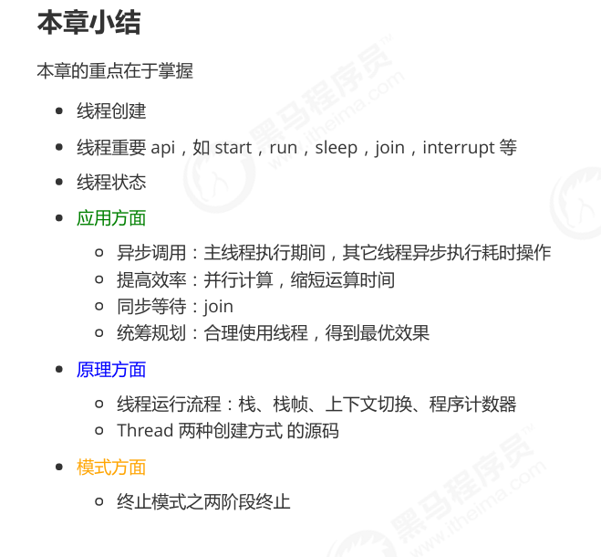


# 4 并发之共享模型

内容:

* 共享问题
* synchronized
* 线程安全分析
* Monitor
* wait/notify
* 线程状态转换
* 活跃性
* Lock


## 4.1 共享问题

* 一个程序运行多个线程本身是没有问题的 

* 问题出在多个线程访问共享资源 
  * 多个线程读共享资源其实也没有问题 
  * 在多个线程对共享资源读写操作时发生指令交错，就会出现问题


**临界区 Critical Section**

一段代码块内如果存在对共享资源的多线程读写操作，称这段代码块为临界区。


**竞态条件 Race Condition**

多个线程在临界区内执行，由于代码的**执行序列不同**而导致结果无法预测，称之为发生了竞态条件


## 4.2  synchronized 解决方案

为了避免临界区的竞态条件发生，有多种手段可以达到目的。 

* 阻塞式的解决方案：synchronized，Lock 
* 非阻塞式的解决方案：原子变量

阻塞式的解决方案：synchronized，即俗称的【对象锁】。它采用互斥的方式让同一 时刻至多只有一个线程能持有【对象锁】，其它线程再想获取这个【对象锁】时就会阻塞住。这样就能保证拥有锁 的线程可以安全的执行临界区内的代码，不用担心线程上下文切换


### 面向对象改进

把需要保护的共享变量放入一个类，即把临界区代码放入类中。`this`作为锁对象。

 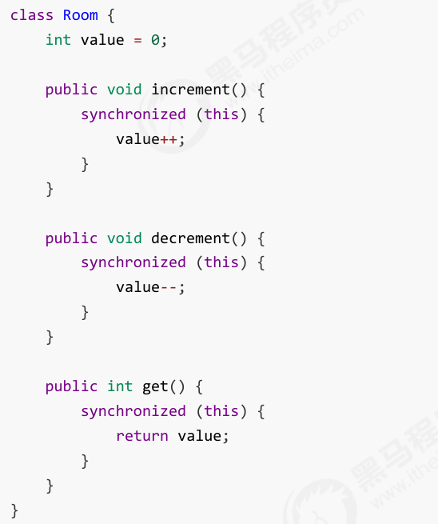

 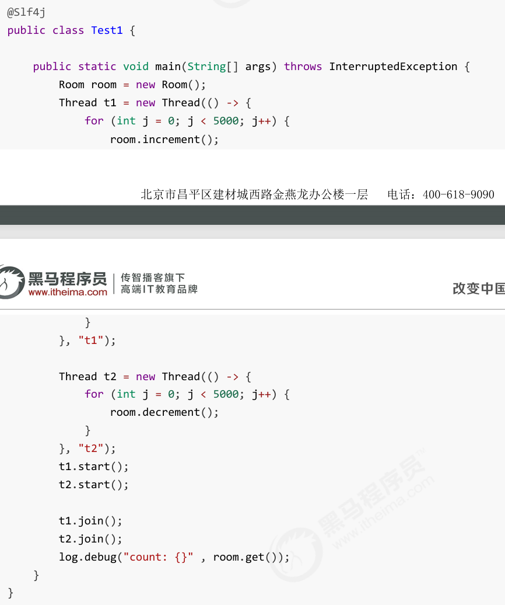

## 4.3、同步方法

在方法前加上`synchronized`修饰。 加在成员方法（锁的是this对象）或者静态方法（锁的是类对象）上。

 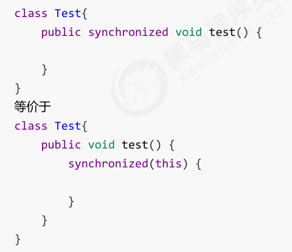

## 4.4、变量的线程安全分析

### 成员变量和静态变量是否线程安全

* 如果它们没有共享，则线程安全
* 如果它们被共享了，根据它们的状态是否能够改变，又分两种情况
  * 如果只有读操作，则线程安全
  * 如果有读写操作，则这段代码是临界区，需要考虑线程安全

### 局部变量是否线程安全

* 局部变量是线程安全的
* 但局部变量引用的对象则未必
  * 如果该对象没有逃离方法的作用访问，它是线程安全的
  * 如果**该对象逃离方法的作用范围**，需要考虑线程安全


方法访问修饰符带来的思考，如果把 method2 和 method3 的方法修改为 public 会不会代理线程安全问题？

* 情况1：有其它线程调用 method2 和 method3

* 情况2：在 情况1 的基础上，为 ThreadSafe 类添加子类，子类覆盖 method2 或 method3 方法，即

  ```java
  class ThreadSafe {
  	 public final void method1(int loopNumber) {
  	 	ArrayList<String> list = new ArrayList<>();
  	 	for (int i = 0; i < loopNumber; i++) {
  	 		 method2(list);
  	 		 method3(list);
  	 	}
  	 }
  	 public void method2(ArrayList<String> list) {
  	 list.add("1");
  	 }
  	 
  	 public void method3(ArrayList<String> list) {
  	 	list.remove(0);
  	 }
  }
  
  class ThreadSafeSubClass extends ThreadSafe{
  	 @Override
  	 public void method3(ArrayList<String> list) {
  	 	 new Thread(() -> {
  	 	 	 list.remove(0);
  	 	 }).start();
  	 }
  }
  	 
  ```

会导致线程不安全，解决办法：

* method3 使用private修饰符，使其无法继承。
* method1 添加final修饰符，防止子类重写。


> 从这个例子可以看出 private 或 final 提供【安全】的意义所在，请体会开闭原则中的【闭】

**四种权限修饰符的作用范围：**

 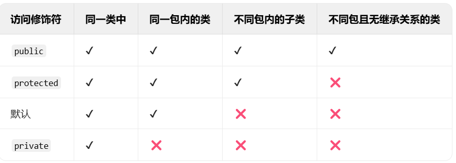


### 常见的线程安全类

 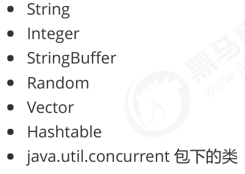

这里说它们是线程安全的是指，多个线程调用它们同一个实例的某个方法时，是线程安全的。也可以理解为

* 它们的每个方法是原子的
* 但注意它们多个方法的组合不是原子的，见后面分析。

