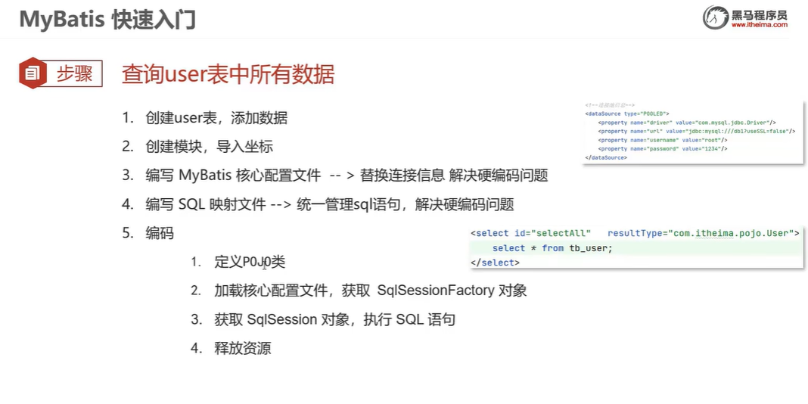

 

 

使用Mapper代理开发：

1. 定义与SQL映射文件同名的Mapper接口，并将该接口和SQL映射文件放置在同一目录下
2. 更改SQL映射文件的namespace属性为 Mapper接口的全限定名
3. 在Mapper接口中定义方法，方法名就是SQL映射文件中sql语句的id，返回值类型就是resultType
4. 获取Mapper接口的代理方法并调用对应方法。

```java
UserMapper userMapper = sqlSession.getMapper(UserMapper.class);
List<User> users = userMapper.selectAll();
```


# 实体类属性名和数据库列名不一致，mybatis不能自动封装数据

  

主要使用resultMap方法：

 

 


 

 

 

# 多条件查询

 

# 多条件-动态条件查询

* 恒等式

 

* where标签

 


 

# 单条件-动态条件查询