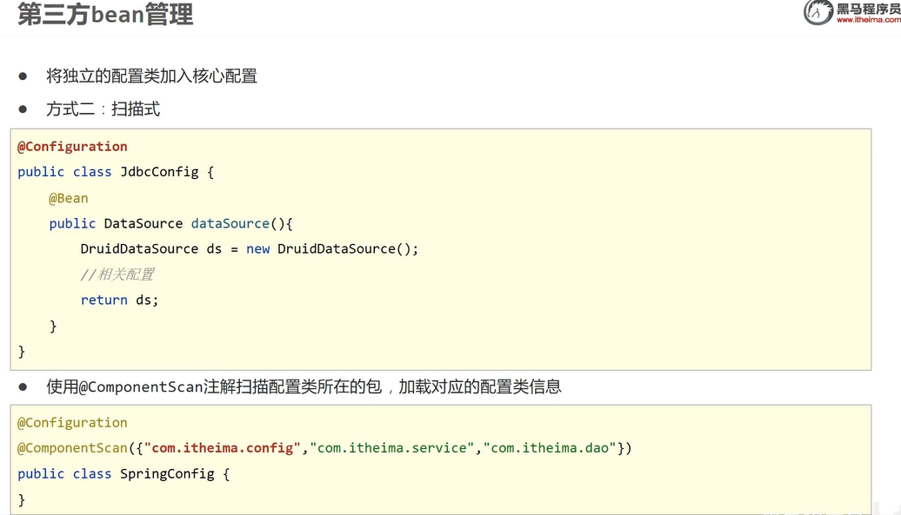
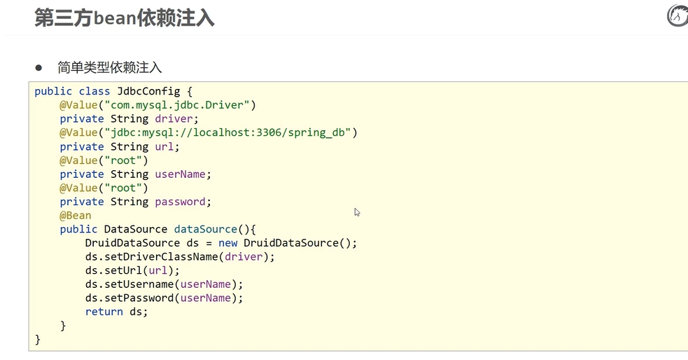

- Spring是轻代码而重配置的框架，配置比较繁重，影响开发效率，所以注解开发是一种趋势，注解代替xml配置文件可以简化配置，提高开发效率。

spring2 推出注解开发

spring3.0 推出纯注解开发

 

# 纯注解开发

使用类代替配置文件

 

**小结：**

 

## Bean作用范围和生命周期

 

 

## 依赖注入

只有**自动装配**

###  注入引用类型 

 

### 注入简单类型

 

value 中的值可能来自于properties文件

 

 

使用：

 

## 管理第三方的Bean

 

 导入式：

扫描式：

 

 

 

 

 

 

 

## xml配置对比注解配置

 