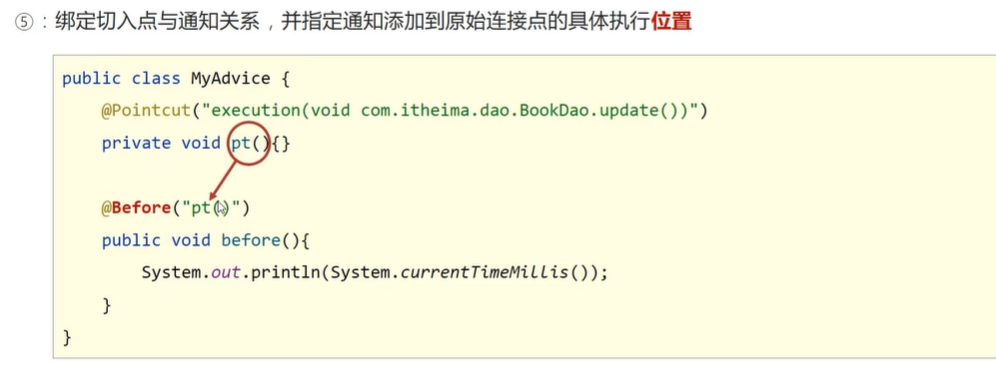
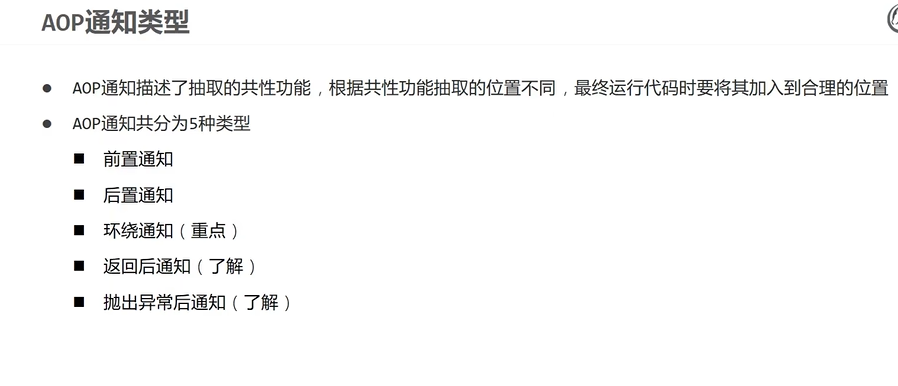

 

 

 

 

 

 

# AOP工作流程

 

# 切入点

切入点表达式：

 

通配符描述切入点表达式

 

 

# AOP通知类型

五种通知类型

 

常用**环绕通知**：

 

 

# AOP获取通知数据

 

[Spring-AOP-CSDN博客](https://blog.csdn.net/qq_39667424/article/details/135562637?ops_request_misc=%7B%22request%5Fid%22%3A%2293BF92CE-B92C-4279-97BB-B27BFC8977F1%22%2C%22scm%22%3A%2220140713.130102334.pc%5Fblog.%22%7D&request_id=93BF92CE-B92C-4279-97BB-B27BFC8977F1&biz_id=0&utm_medium=distribute.pc_search_result.none-task-blog-2~blog~first_rank_ecpm_v1~rank_v31_ecpm-1-135562637-null-null.nonecase&utm_term=aop&spm=1018.2226.3001.4450)