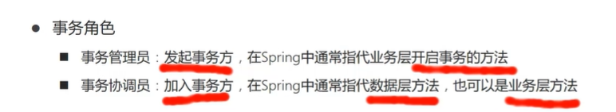

[TOC]

# spring事务简介

使一起的两个事务同成功或者同失败。

步骤：

1. 在业务层 **接口**上添加Spring事务管理。

 

 

2. 设置事务管理器

 

3. 开启注解式事务驱动

 

# spring事务角色

 

 

# spring属性

 

可以在注解中开启

重点 `rollbackFor` ：

有些异常默认不会回滚事务，需要手动在注解中加入：

 

# 事务传播行为

 

将日志功能放到另一个事务中，从而方式转账失败但事务没记录的情况。

 

使用属性中的propagation 来设置事务的传播行为。

 

 