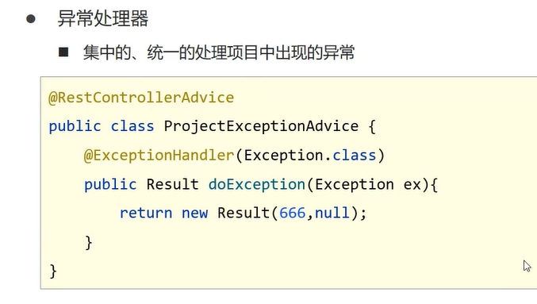

 

 

 

1. 异常要分类处理
2. 异常要放在表现层处理
3. 异常要使用AOP的思想处理


Spring中的异常处理器

 

写在表现层


```java
@RestControllerAdvice   //声明一个类作为异常处理器类
public class ProjectExceptionAdvice {

    @ExceptionHandler(Exception.class)  //是用来处理哪一种异常的，拦截对应的异常
    public Result doException(Exception ex){
        System.out.println("异常出现");

        return new Result(666,null,"异常出现");

    }
}
```


# 项目异常分类

