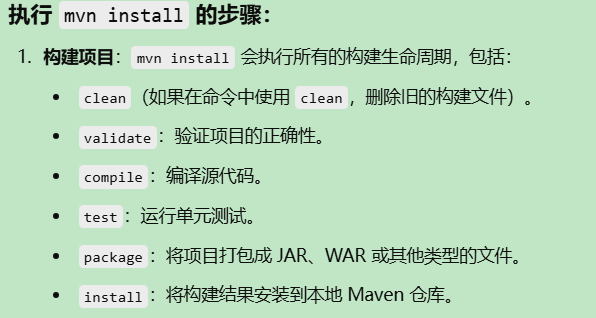

 

常用命令：

* `mvn clean` ：清理项目。这个命令会删除项目的 `target` 目录，其中包含上次构建的所有编译文件和构建产物
* `mvn compile`：编译项目的源代码。这个命令会将项目中的所有源代码
* `mvn test`：运行项目中的单元测试。这个命令会执行 `src/test/java` 目录下的所有测试类。
* `mvn package`：打包项目。将编译后的代码和资源文件打包成 JAR、WAR 或其他格式的文件，默认保存在 `target` 目录下。
* `mvn install`：执行上述所有过程，并将构建结果安装到本地Maven仓库。
* `mvn deploy`：将构建的产物部署到远程仓库。这个命令通常在发布版本时使用。
* `mvn clean install`：清理并安装