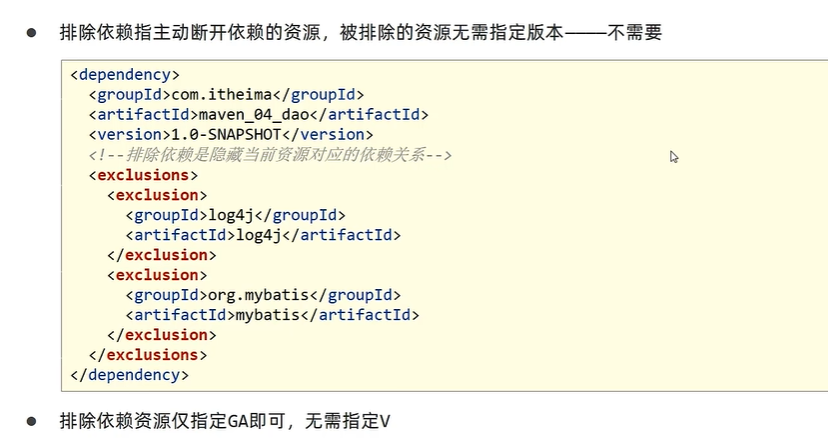

# 依赖传递

 

 


# 依赖冲突

 

# 可选依赖

可选依赖是隐藏当前工程所依赖的资源，隐藏的对应资源将不具有依赖传递性。

可选依赖是在maven坐标中加入 <optional> true</optional> 这个标签


# 排除依赖

排除依赖是在当前引用的坐标中，将依赖传递的依赖去除掉。

```xml
<exclusions>
    <exclusion>
    	<groupId>...</groupId>
    	<artifactId>...</artifactId>
     </exclusion>
</exclusions>
```


可选依赖是隐藏自己使用的依赖，排除依赖是不用别人使用的依赖。

 

  

