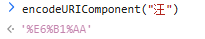
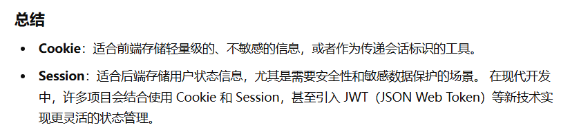

**URL 编码**（URL encoding）是一种用于在 URL 中安全传输数据的方式，它将 URL 中的非安全字符转换为特定格式。

URL 编码的步骤通常如下：

- 首先，将数据按照特定字符编码（通常是 UTF-8）转换为字节序列。
- 然后，对每个字节进行 URL 编码转换：
  - 对于 ASCII 字母和数字，保持不变。
  - 对于空格（空格可以用 `%20` 表示）、标点符号和其他特殊字符，转换为 `%` 符号后跟**两位**十六进制数（例如空格为 `%20`）。
  - 对于非 ASCII 字符，通常将其编码为 `%` 符号后跟其 UTF-8 字符编码的十六进制表示。

 

---

> Base64编码是一种将二进制数据转换为文本字符串的方法，其主要用途是在各种情况下将非文本数据转换为可以安全传输的文本格式。以下是关于Base64编码的基本概念和用途：

Base64编码将每组三个字节（即24位）的数据转换成四个由64个可打印字符组成的ASCII字符。每个Base64字符可以表示6位。

- Base64编码使用了64个字符：大写字母 A-Z、小写字母 a-z、数字 0-9，以及两个额外的符号 + 和 /。
- = 字符通常用作填充字符，用于使编码后的文本长度为4的倍数。

用途：

Base64编码通常用于在HTTP协议、电子邮件、XML等文本传输协议中，将二进制数据（如图片、音频、视频等）转换为文本，以便传输。假设有一个二进制文件，Base64编码可以将其转换为文本格式。例如，将一张图片编码为Base64格式后，可以在HTML中直接使用这段文本作为图片的源。

---

**Consumer 函数式接口：**

在 Java 中，`Consumer` 是一个函数式接口，它属于 `java.util.function` 包。函数式接口是指只包含一个抽象方法的接口，通常用于支持 *Lambda 表达式*。

```java
@FunctionalInterface
public interface Consumer<T> {
    void accept(T t);
}
```

`Consumer` 接口主要用于表示执行某些操作的单参数方法。它通常用于接收一个参数，并对该参数执行一些操作，如打印、保存到数据库等。


***

# cookie和session在前后端中的作用是什么

**Cookie** 和 **Session** 是 Web 开发中常用的技术，主要用于==存储和管理用户的状态信息==，==解决 HTTP 协议无状态性的问题==。

## **Cookie 的作用**

**Cookie** 是存储在客户端（浏览器）的一小段数据，由服务器生成并发送到客户端，随后客户端会在每次请求时将 Cookie 附加到请求头中发送回服务器。

### 1. **在前端中的作用**

- **存储少量数据**：前端可以使用 Cookie 存储一些需要在多个页面间共享的少量数据，例如用户首选项、会话标识符等。
- **实现简单的状态管理**：前端可以通过 JavaScript 操作 Cookie 实现简单的状态管理，例如记录用户登录状态。
- **跨页面传递数据**：Cookie 的生命周期可跨页面（甚至跨会话），适用于需要在不同页面共享的信息。

### 2. **在后端中的作用**

- **会话跟踪**：服务器使用 Cookie 来跟踪用户会话。例如，服务器向客户端发送一个包含会话 ID 的 Cookie，客户端每次请求都会附带这个 Cookie，服务器就能识别出用户。
- **存储用户信息**：后端可以通过设置 Cookie 保存一些基本信息，如用户偏好设置、登录状态等。


## **Session 的作用**

**Session** 是一种在服务器端存储的机制，用于==保存用户的状态信息==。通常，Session 依赖于 Cookie 来传递会话 ID。

### 1. **在前端中的作用**

- **会话标识的传递**：前端通过浏览器将 Session ID（通常存储在 Cookie 中）发送到服务器，完成会话管理。
- **与后端交互的桥梁**：前端不直接操作 Session，而是通过 Cookie 或其他方式（如 URL 参数）将会话信息传递给后端。

### 2. **在后端中的作用**

- **存储敏感数据**：Session 存储在服务器端，更适合保存敏感信息，例如用户的权限信息、购物车数据等。
- **用户状态管理**：通过 Session，后端可以跟踪用户的登录状态和与应用的交互。
- **减少数据传输**：与 Cookie 不同，Session 不需要在每次请求时传输完整的状态信息，只需传递 Session ID。



****

# protected修饰符

在java中`protected` 是一种访问修饰符，用于修饰类的成员（包括变量、方法等）。当一个成员变量被声明为 `protected` 时，它的访问范围如下：

1. **同一包内的类**：`protected` 成员变量可以被同一包中的其他类访问。这意味着，即使是不同的类，只要它们在同一个包内，它们也能访问 `protected` 成员。
2. **不同包中的子类**：`protected` 成员变量可以被不同包中的子类访问。这是 `protected` 相对于 `private` 的一个优势，因为 `private` 变量不能被子类访问，而 `protected` 可以。

***


